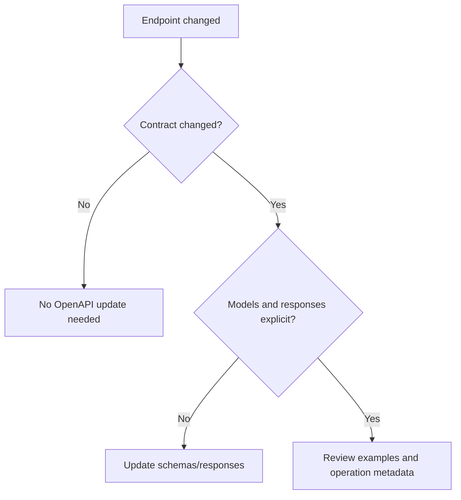

# FastAPI OpenAPI

OpenAPI is the public contract documentation for FastAPI services.

## Philosophy

API documentation is not decorative. It is a contract that clients, tests, and
future agents use to understand behavior. Incomplete OpenAPI metadata creates
integration risk.

## Rules

- Every endpoint must have explicit request and response models where
  applicable.
- Document status codes and error responses.
- Use clear tags and operation IDs.
- Keep examples realistic and safe.
- Do not expose internal model names or infrastructure details.
- Update OpenAPI when API behavior changes.

## Bad Example

```python
@router.post("/restore")
async def restore(payload: dict):
    ...
```

## Good Example

```python
@router.post(
    "/restore",
    response_model=RestoreResponse,
    responses={404: {"model": ErrorResponse}},
    operation_id="restoreBackup",
)
async def restore(request: RestoreRequest) -> RestoreResponse:
    ...
```

## Decision Tree



## AI Guidance

- Treat OpenAPI drift as a contract defect.
- Do not include secrets or production identifiers in examples.
- Prefer stable operation IDs for generated clients.

## Review Checklist

- Request and response models are explicit.
- Error responses are documented.
- Tags and operation IDs are stable.
- Examples are safe and useful.
- OpenAPI reflects actual behavior.

## References

- API Guidelines: `../architecture/api-guidelines.md`
- Pydantic v2: `../python/pydantic-v2.md`
- Errors: `errors.md`
