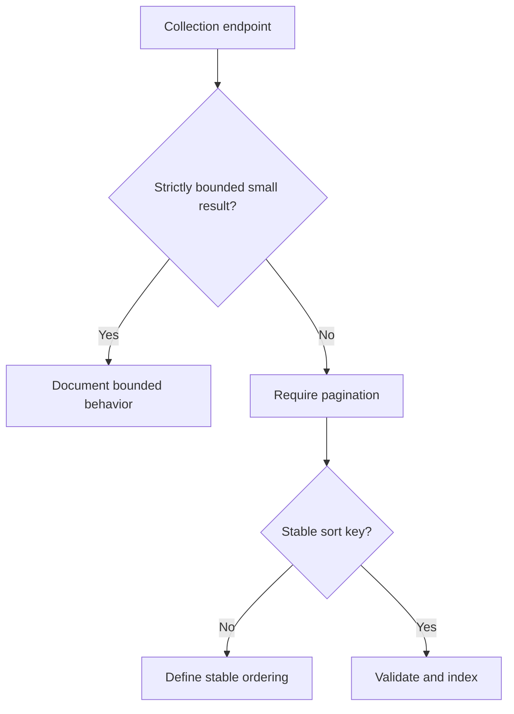

# FastAPI Pagination

Pagination keeps collection endpoints bounded, stable, and efficient.

## Philosophy

Unbounded list endpoints are operational risk. Pagination is part of API design,
query performance, and client compatibility.

## Rules

- Collection endpoints must define pagination unless the collection is strictly
  bounded.
- Enforce maximum page size.
- Use stable ordering.
- Return pagination metadata or cursors consistently.
- Validate page parameters.
- Ensure database queries are indexed for pagination order/filter paths.

## Bad Example

```python
@router.get("/jobs")
async def list_jobs():
    return await service.list_all_jobs()
```

## Good Example

```python
@router.get("/jobs", response_model=Page[JobResponse])
async def list_jobs(page: PageParams = Depends(get_page_params)) -> Page[JobResponse]:
    return await service.list_jobs(page)
```

## Decision Tree



## AI Guidance

- Do not add list endpoints without page limits.
- Prefer cursor pagination for large or changing datasets when offset is unsafe.
- Align response shape across APIs.

## Review Checklist

- Page size has default and maximum.
- Ordering is stable.
- Query path is index-aware.
- Response includes pagination metadata.
- Tests cover bounds and invalid parameters.

## References

- Filtering: `filtering.md`
- SQLAlchemy 2.x: `../python/sqlalchemy2.md`
- Performance Metrics: `../metrics/performance.md`
