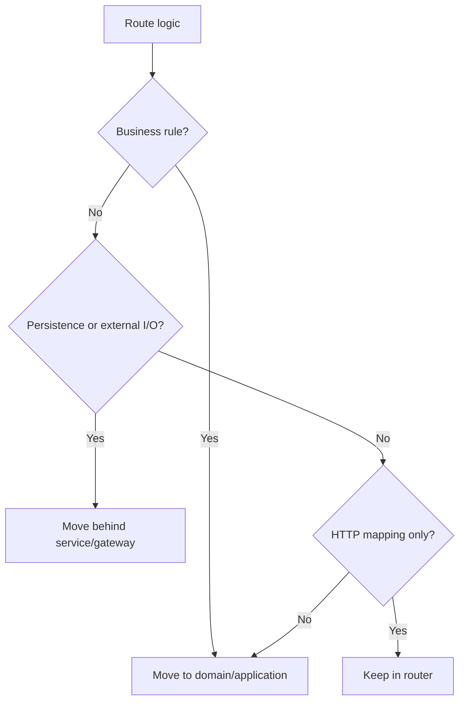

# FastAPI Routers

Routers are HTTP adapters. They should translate HTTP requests into application
commands and application results into HTTP responses.

## Philosophy

A route function should be boring. If a route contains business rules,
transaction orchestration, SQL, storage calls, or complex branching, the HTTP
boundary is absorbing responsibilities that belong elsewhere.

## Rules

- Keep route functions thin: parse, authorize, call service, map response.
- Use explicit `response_model` values.
- Group routes by resource or use case, not by infrastructure concern.
- Do not create database sessions, external clients, or domain workflows inside
  routers.
- Do not return ORM models directly.

## Bad Example

```python
@router.post("/jobs")
async def create_job(request: CreateJobRequest, session: Session = Depends(get_session)):
    if request.retention_days > 365:
        raise HTTPException(400, "invalid retention")
    record = JobRecord(**request.model_dump())
    session.add(record)
    session.commit()
    return record
```

## Good Example

```python
@router.post("/jobs", response_model=CreateJobResponse, status_code=201)
async def create_job(
    request: CreateJobRequest,
    service: CreateJobService = Depends(get_create_job_service),
) -> CreateJobResponse:
    result = await service.create(request.to_command())
    return CreateJobResponse.from_result(result)
```

## Decision Tree



## AI Guidance

- Route functions should usually be short enough to review at a glance.
- Prefer application commands and response mappers over passing schemas inward.
- Keep dependency wiring visible at the router edge.

## Review Checklist

- Router contains no substantial business logic.
- Request and response schemas are explicit.
- Status codes are intentional.
- ORM models and infrastructure exceptions do not leak.
- Dependencies are edge composition only.

## References

- Dependencies: `dependencies.md`
- Pydantic v2: `../python/pydantic-v2.md`
- Clean Architecture: `../architecture/clean-architecture.md`
