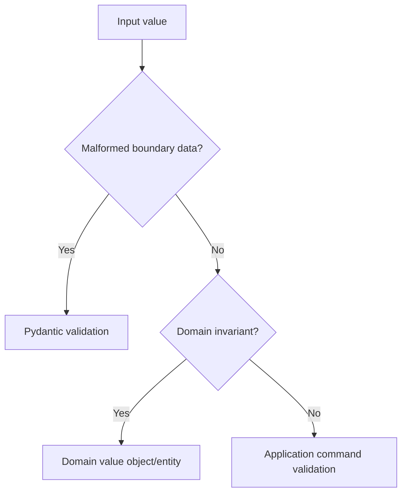

# FastAPI Validation

Validation protects HTTP boundaries from malformed input and maps validated data
into application commands or domain values.

## Philosophy

Validate early at the boundary, then enforce domain invariants in the domain.
Boundary validation should not become a scattered substitute for domain rules.

## Rules

- Use Pydantic v2 schemas for request bodies.
- Use constrained fields for simple boundary checks.
- Forbid unexpected input fields unless extension is deliberate.
- Validate path and query parameters explicitly.
- Map schemas into command/value objects before application logic.
- Return consistent validation error responses.

## Bad Example

```python
@router.post("/backups")
async def create_backup(payload: dict):
    if payload["retention"] < 1:
        ...
```

## Good Example

```python
class CreateBackupRequest(BaseModel):
    model_config = ConfigDict(extra="forbid")
    retention_days: int = Field(ge=1, le=365)

    def to_command(self) -> CreateBackupCommand:
        return CreateBackupCommand(retention=RetentionDays(self.retention_days))
```

## Decision Tree



## AI Guidance

- Do not accept raw `dict` for known request bodies.
- Keep boundary normalization separate from domain decisions.
- Validate identifiers, pagination, filtering, and path values.

## Review Checklist

- Inputs have explicit schemas.
- Unexpected fields are rejected or justified.
- Domain invariants have domain owners.
- Validation errors are safe and consistent.
- Tests cover invalid inputs and edge values.

## References

- Pydantic v2: `../python/pydantic-v2.md`
- Errors: `errors.md`
- Primitive Obsession: `../smells/primitive-obsession.md`
