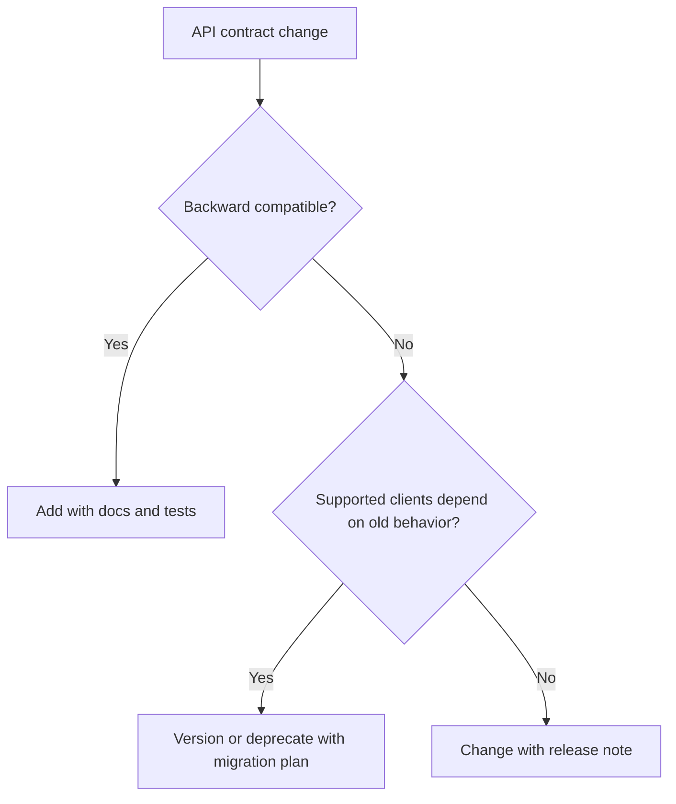

# FastAPI Versioning

API versioning manages compatibility as HTTP contracts evolve.

## Philosophy

Breaking API changes are product and architecture decisions. Versioning should
protect clients from surprise while avoiding unnecessary parallel APIs.

## Rules

- Define whether an API is internal, partner, or public before changing it.
- Do not introduce breaking changes without versioning or migration plan.
- Prefer additive changes when compatible.
- Version public APIs consistently, commonly by path or explicit contract policy.
- Document deprecation windows and removal criteria.
- Keep old versions tested while supported.

## Bad Example

```python
# Existing response field silently renamed from job_id to id.
return {"id": job.id}
```

## Good Example

```python
@router_v1.get("/jobs/{job_id}", response_model=JobV1Response)
async def get_job_v1(job_id: str) -> JobV1Response:
    ...


@router_v2.get("/jobs/{job_id}", response_model=JobV2Response)
async def get_job_v2(job_id: str) -> JobV2Response:
    ...
```

## Decision Tree



## AI Guidance

- Treat response shape changes as compatibility risk.
- Do not version APIs speculatively.
- Keep deprecation records in Project Brain or release notes.

## Review Checklist

- Compatibility impact is known.
- Versioning strategy is consistent.
- Deprecated behavior has owner and removal trigger.
- Supported versions are tested.
- OpenAPI reflects active versions.

## References

- OpenAPI: `openapi.md`
- Release Checklist: `../checklists/release.md`
- Product Manager: `../agents/product-manager.md`
