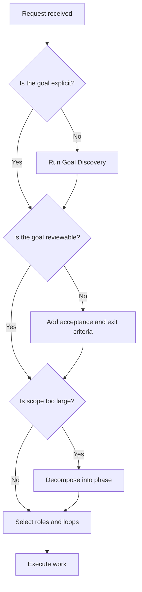

# Goal Engineering

Goal Engineering is the discipline of turning intent into an executable,
measurable, reviewable engineering objective. Every AI-assisted task begins
here.

## Philosophy

Legacy modernization is full of ambiguous requests: "clean this up", "make it
modern", "fix the architecture", "add tests", "improve performance". These
phrases are not goals. A usable goal defines what should change, why it matters,
how success will be measured, what constraints apply, and when the work is done.

Good goals protect teams from over-engineering, under-delivery, and accidental
behavior changes.

## Required Goal Record

Every task must define:

- goal statement;
- problem or opportunity;
- stakeholders;
- scope and non-scope;
- assumptions;
- constraints;
- risks;
- acceptance criteria;
- exit criteria;
- success metrics;
- responsible AI roles;
- required engineering loops.

## Goal Discovery

Use discovery when intent is unclear or business context is missing.

Questions:

- What user, operator, engineer, or business outcome is affected?
- What pain exists today?
- What behavior must remain unchanged?
- What constraints cannot be violated?
- What evidence will prove success?
- What risks are unacceptable?
- What must not be done in this phase?

Outputs:

- concise problem statement;
- stakeholder map;
- initial assumptions;
- known constraints;
- candidate metrics.

## Goal Decomposition

Large goals must be decomposed into independently reviewable slices.

Good slices:

- produce durable value;
- have clear acceptance criteria;
- minimize cross-module blast radius;
- can be tested or reviewed;
- update Project Brain.

Bad slices:

- "refactor everything";
- "create all standards";
- "modernize the backend";
- "improve quality";
- "make it scalable".

Decision rule: if a slice cannot be reviewed in one focused review, split it.

## SMART Goals

Use SMART to make a goal executable:

- Specific: names the affected behavior, document, module, or workflow.
- Measurable: defines observable evidence.
- Achievable: fits constraints and current system state.
- Relevant: maps to mission, roadmap, risk, or stakeholder value.
- Time-bounded: has a phase boundary or review stop.

Example:

Bad:

```text
Improve architecture docs.
```

Good:

```text
Create the Phase 1 AI-OS governing spine by replacing skeletal root governance
documents with complete standards for architecture, goal engineering, loops,
roles, Project Brain, state, next task, manifest, and changelog; stop after
pushing the phase for review.
```

## CLEAR Goals

Use CLEAR to keep goals adaptive:

- Collaborative: identifies roles and handoffs.
- Limited: constrains scope and phase size.
- Emotional: connects to a meaningful pain or outcome.
- Appreciable: decomposes into small reviewable work.
- Refinable: can adapt as evidence appears.

CLEAR prevents rigid plans from surviving after analysis proves them wrong.

## OKRs

Use OKRs for roadmap-level modernization, not small implementation tasks.

Objective:

- qualitative direction;
- memorable and outcome-focused.

Key results:

- measurable;
- time-bound;
- few enough to guide trade-offs.

Example:

Objective: Make AI-assisted modernization safe for legacy service extraction.

Key results:

- 100% of modernization tasks include goal, loop, and Project Brain updates.
- All architecture-impacting changes include ADRs or documented exceptions.
- Critical workflows have automated regression tests before extraction.

## KPIs

KPIs measure ongoing health:

- lead time for modernization slices;
- escaped defects;
- test coverage for critical workflows;
- cyclomatic complexity trend;
- duplicated code trend;
- security findings by severity;
- deployment failure rate;
- rollback rate;
- documentation freshness;
- unresolved decision age.

KPIs are not goals by themselves. They inform goals.

## Constraints

Constraints are binding limits:

- technology stack;
- compliance requirements;
- deployment windows;
- backwards compatibility;
- data retention;
- team capacity;
- runtime cost;
- performance budget;
- security policy.

Every constraint must be testable or reviewable. Vague constraints such as "keep
it enterprise-grade" must be translated into concrete rules.

## Risks

Risk format:

```text
Risk: What might go wrong.
Likelihood: Low, medium, high.
Impact: Low, medium, high.
Mitigation: Action that reduces likelihood or impact.
Owner: Responsible role.
Trigger: Signal that the risk is becoming real.
```

Risks that remain after mitigation must be accepted by the role with authority.

## Acceptance Criteria

Acceptance criteria define what must be true for the user, system, or reviewer.

Good criteria:

- observable;
- unambiguous;
- tied to behavior or document quality;
- independent of implementation trivia;
- testable through review, tests, or evidence.

Bad:

```text
The docs should be good.
```

Good:

```text
Each completed standard includes philosophy, binding rules, rationale,
examples, decision guidance, AI guidance, review checklist, and cross-links.
```

## Exit Criteria

Exit criteria define when the phase can stop.

Standard exit criteria:

- acceptance criteria satisfied;
- required checks completed;
- Project Brain updated or explicitly unchanged;
- manifest updated;
- project state updated;
- next task defined;
- changelog updated;
- changes committed and pushed when Git is configured;
- human review requested.

## Success Metrics

Success metrics must map to the goal's purpose:

- quality goals use defect, review, complexity, duplication, or coverage
  metrics;
- architecture goals use boundary clarity, dependency direction, ADR coverage,
  or exception count;
- product goals use adoption, completion, conversion, or operational outcome
  metrics;
- performance goals use latency, throughput, resource, and saturation metrics;
- documentation goals use completeness, freshness, discoverability, and
  cross-reference quality.

## Decision Tree



## AI Guidance

- Do not convert a broad mission into unlimited work. Create a bounded phase.
- State non-scope explicitly.
- If the user interrupts or redirects, re-evaluate the goal before continuing.
- If evidence changes the goal, update the goal record and explain the trade-off.
- A final answer must report what was completed and what remains.

## Review Checklist

- Goal is specific and measurable.
- Scope and non-scope are explicit.
- Constraints and risks are recorded.
- Acceptance criteria and exit criteria are testable.
- Responsible roles are identified.
- Required loops are selected.
- Success metrics match the outcome.
- Project Brain update requirement is clear.

## References

- Architecture Constitution: `../architecture/constitution.md`
- Engineering Loops: `../loops/README.md`
- Product Acceptance Criteria: `../product/acceptance-criteria.md`
- Project Brain: `../brain/README.md`
