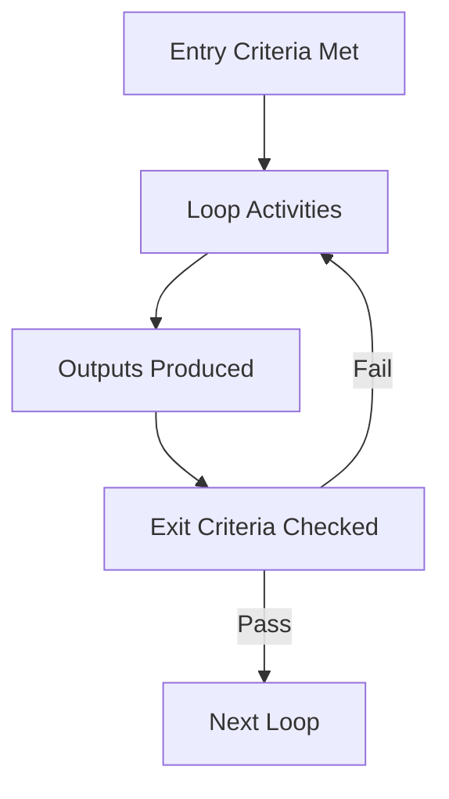

# Engineering Loops

Engineering loops are repeatable workflows that turn a goal into reviewable
work. A loop is not a ceremony. It is the minimum disciplined sequence needed to
avoid accidental architecture, unclear acceptance criteria, and undocumented
decisions.

## Common Loop Contract

Every loop defines:

- entry criteria;
- activities;
- outputs;
- exit criteria;
- checklist.

Agents may combine loops, but they must not skip the gate that proves the work
is ready for the next stage.

## Loop Catalog

| Loop | Primary Owner | Use When | Required Output |
| --- | --- | --- | --- |
| Discovery | Product Manager | Problem, users, business rules, or scope are unclear. | Goal brief and assumptions |
| Analysis | Software Architect | Legacy behavior, dependencies, or risks must be understood. | Analysis notes and risk list |
| Design | Software Architect | A solution shape must be selected before implementation. | Design option and trade-off record |
| Architecture | Software Architect | Boundaries, dependencies, data flow, or deployment topology change. | ADR or architecture update |
| Implementation | Backend Engineer | Code changes are required. | Code, tests, and migration notes |
| Testing | QA Engineer | Behavior must be verified. | Test evidence and coverage notes |
| Security | Security Engineer | Trust boundaries, auth, secrets, data protection, or dependency risk are in scope. | Security review evidence |
| Performance | Performance Engineer | Latency, throughput, resource use, or scalability matters. | Performance budget and measurement |
| Documentation | Technical Writer | Knowledge must be preserved or communicated. | Updated durable documentation |
| Review | Reviewer | A work product is ready for independent critique. | Findings or approval |
| Deployment | Release Manager | Changes move toward runtime environments. | Release and rollback plan |
| Retrospective | CTO | A phase or incident closes. | Lessons and improvement actions |

## Required Loop Selection

Use the smallest loop set that satisfies the goal:

- Documentation-only standards work requires Goal, Documentation, Review, and
  Project Brain updates.
- Code modernization requires Goal, Analysis, Design or Architecture,
  Implementation, Testing, Review, and Documentation.
- Security-sensitive work adds the Security Loop.
- Performance-sensitive work adds the Performance Loop.
- Runtime delivery adds the Deployment Loop.

## Loop Checklists

### Discovery Loop

Entry criteria:

- A problem, opportunity, or modernization request exists.
- Stakeholders or impacted users can be identified.

Activities:

- Capture current pain, desired outcome, constraints, and unknowns.
- Identify business rules and acceptance criteria.
- Separate facts from assumptions.

Outputs:

- Goal statement.
- Stakeholder list.
- Assumptions, constraints, and risks.

Exit criteria:

- The work can be accepted or rejected using objective criteria.

### Analysis Loop

Entry criteria:

- A goal exists.
- The relevant system area is known.

Activities:

- Inspect code, data flow, dependencies, runtime behavior, tests, and docs.
- Identify coupling, hidden state, risk, and unclear ownership.

Outputs:

- Findings, risk list, affected boundaries, and recommended next loop.

Exit criteria:

- The agent can explain what must change and what must not change.

### Design and Architecture Loops

Entry criteria:

- Analysis reveals multiple viable approaches or architecture impact.

Activities:

- Compare options against constitution rules, constraints, complexity, and risk.
- Prefer explicit boundaries, ports, dependency injection, and simple domain
  models.

Outputs:

- Design notes, ADR when needed, updated diagrams when helpful.

Exit criteria:

- Trade-offs and exceptions are explicit.

### Implementation Loop

Entry criteria:

- Goal, acceptance criteria, and design direction are clear.

Activities:

- Make narrow changes.
- Add or update tests.
- Preserve behavior unless the goal says otherwise.
- Update documentation and Project Brain.

Outputs:

- Code, tests, migrations, operational notes, and evidence.

Exit criteria:

- Definition of Done is satisfied.

### Testing, Security, and Performance Loops

Entry criteria:

- A work product or design requires verification.

Activities:

- Validate behavior, failure modes, abuse cases, resource usage, and regression
  risk.

Outputs:

- Test results, findings, budgets, and remediation notes.

Exit criteria:

- Risks are resolved, accepted, or escalated.

### Documentation, Review, Deployment, and Retrospective Loops

Entry criteria:

- Work has created knowledge, change, or release impact.

Activities:

- Preserve durable decisions.
- Review against checklists.
- Prepare release and rollback plans when applicable.
- Capture lessons learned.

Outputs:

- Updated docs, review findings, release notes, Project Brain updates.

Exit criteria:

- A future agent can understand the decision without reconstructing it from
  chat history.

## AI Guidance

- Do not treat a loop as complete because a document exists. Check the exit
  criteria.
- If entry criteria are not met, run the preceding loop instead of guessing.
- If a task spans multiple roles, name the responsible role for each gate.
- Record unresolved uncertainty in Project Brain instead of burying it in a
  transient conversation.
