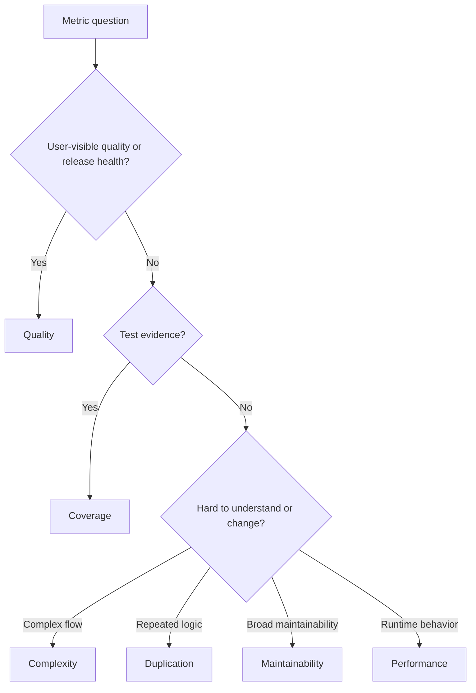

# Metrics Standards Index

Metrics help AI agents and reviewers evaluate delivery quality with evidence.
They are signals for judgment, not substitutes for engineering reasoning.

## Use This Index

Use this page when defining KPIs, reviewing quality gates, interpreting test
results, or deciding whether a modernization change improved or degraded the
system.

## Severity Model

| Severity | Meaning | Required Action |
| --- | --- | --- |
| Critical | Metric reveals broken correctness, unsafe release risk, data loss risk, or violated SLO/security gate. | Block completion or escalate. |
| High | Metric trend shows likely maintainability, performance, or reliability regression. | Fix or record owned risk. |
| Medium | Metric needs context before it can guide action. | Investigate and document interpretation. |
| Low | Metric collection or reporting inconsistency. | Improve opportunistically. |

## Standards Catalog

| Standard | Measures | Common Misuse |
| --- | --- | --- |
| [Quality](quality.md) | Defect, review, readiness, and release quality. | Counting activity as value |
| [Coverage](coverage.md) | Test evidence for behavior and risk. | Chasing percentage alone |
| [Complexity](complexity.md) | Cognitive and cyclomatic complexity. | Ignoring domain complexity |
| [Duplication](duplication.md) | Repeated code or business rules. | Removing useful symmetry blindly |
| [Performance](performance.md) | Latency, throughput, resource use, scalability. | Optimizing without a product NFR |
| [Maintainability](maintainability.md) | Ease of safe change over time. | Reducing maintainability to one score |

## Routing Decision Tree

## AI Guidance

- Pair every metric with interpretation, threshold, owner, and action.
- Prefer trend and risk-based review over isolated numbers.
- Do not game metrics by weakening tests, splitting functions mechanically, or
  hiding complexity behind indirection.
- Tie product-facing metrics to NFRs, acceptance criteria, or SLOs.
- Record new durable metric gates in Project Brain or checklists.

## References

- Product NFRs: `../product/nfrs.md`
- Code Review: `../checklists/code-review.md`
- Goal Engineering KPIs: `../goals/goal-engineering.md`
