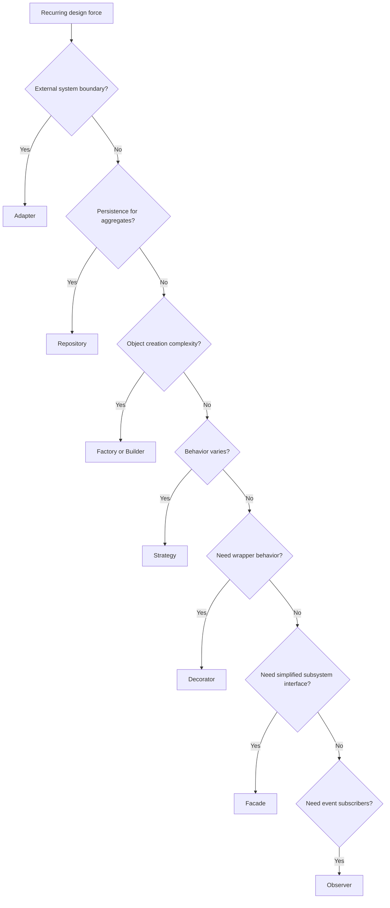

# Design Pattern Standards Index

Design patterns are named solutions to recurring design forces. In this AI-OS,
patterns are tools for clarity and boundary protection, not decorations or
mandatory templates.

## Use This Index

Use this page when a design problem recurs, variation is real, or a boundary
needs an explicit collaboration shape.

## Severity Model

| Severity | Meaning | Required Action |
| --- | --- | --- |
| Critical | Pattern use violates dependency direction, hides data mutation, or bypasses architecture governance. | Block or redesign. |
| High | Pattern adds avoidable coupling, indirection, or runtime magic. | Simplify or justify with tests and ADR. |
| Medium | Pattern is useful but inconsistently named, scoped, or tested. | Align with standard. |
| Low | Local naming or documentation issue. | Fix opportunistically. |

## Pattern Catalog

| Pattern | Use When | Avoid When |
| --- | --- | --- |
| [Adapter](adapter.md) | Translating external APIs into internal ports. | Core code can call framework/client types directly. |
| [Repository](repository.md) | Abstracting aggregate persistence. | Hiding arbitrary queries behind a vague DAO. |
| [Factory](factory.md) | Creation has invariants or variant selection. | Constructor call is obvious and stable. |
| [Strategy](strategy.md) | Behavior varies behind one contract. | A simple branch is clearer. |
| [Decorator](decorator.md) | Adding cross-cutting behavior around a port. | Behavior changes the core contract. |
| [Facade](facade.md) | Simplifying a complex subsystem boundary. | It becomes a god service. |
| [Builder](builder.md) | Constructing complex test or domain objects safely. | It hides required fields or invalid states. |
| [Observer](observer.md) | Publishing events to independent subscribers. | Synchronous control flow needs a direct call. |

## Routing Decision Tree

## AI Guidance

- Start with KISS and YAGNI before adding a pattern.
- Name the design force before naming the pattern.
- Prefer explicit protocols, ports, and plain Python composition.
- Add tests that prove the variation or boundary behavior.
- Record an ADR when a pattern shapes a durable architecture boundary.

## References

- Architecture: `../architecture/README.md`
- Engineering Principles: `../engineering/README.md`
- Clean Code: `../clean-code/README.md`
- Domain Modeling: `../domain/README.md`
