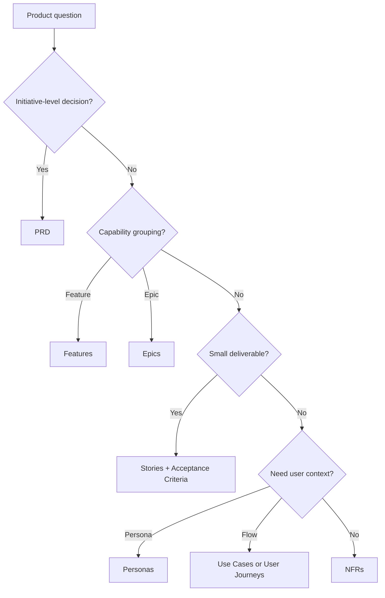

# Product Standards Index

Product standards define how AI agents turn business intent into executable,
reviewable engineering work. They prevent modernization from becoming a
technology exercise detached from users, operators, risk, and measurable value.

## Use This Index

Use this page before implementation when work changes user behavior, business
rules, workflows, non-functional requirements, public APIs, operational
experience, or delivery priority.

## Severity Model

| Severity | Meaning | Required Action |
| --- | --- | --- |
| Critical | Work lacks a valid goal, acceptance criteria, stakeholder, or non-negotiable constraint. | Block Definition of Ready. |
| High | Product scope, user value, or NFRs are ambiguous enough to cause rework or unsafe delivery. | Clarify before design or record accepted risk. |
| Medium | Product artifact is useful but incomplete, stale, or weakly connected to tests. | Improve before completion. |
| Low | Formatting, naming, or cross-link issue. | Fix opportunistically. |

## Standards Catalog

| Standard | Use When | Output |
| --- | --- | --- |
| [PRD](prd.md) | Defining a meaningful product initiative. | Decision-ready product brief |
| [Features](features.md) | Grouping related user capabilities. | Feature definition and boundaries |
| [Epics](epics.md) | Slicing large work into reviewable delivery groups. | Epic with outcomes and constraints |
| [Stories](stories.md) | Defining small user-facing changes. | Story with acceptance criteria |
| [Personas](personas.md) | Understanding affected users and operators. | Persona with goals and pain |
| [Use Cases](use-cases.md) | Capturing actor-system interactions. | Main, alternate, and failure flows |
| [User Journeys](user-journeys.md) | Mapping end-to-end experience. | Journey stages and friction |
| [Acceptance Criteria](acceptance-criteria.md) | Defining observable done conditions. | Testable criteria |
| [NFRs](nfrs.md) | Defining quality attributes. | Measurable non-functional requirements |

## Routing Decision Tree

## AI Guidance

- Start with `../goals/goal-engineering.md`.
- Do not begin design or implementation without acceptance criteria and
  constraints.
- Treat operators, support teams, security, compliance, and future maintainers
  as product stakeholders when modernization affects them.
- Keep product artifacts concise but decision-ready.
- Update Project Brain when product work reveals business rules, glossary terms,
  risks, or roadmap changes.

## References

- Goal Engineering: `../goals/goal-engineering.md`
- Definition of Ready: `../checklists/definition-of-ready.md`
- Definition of Done: `../checklists/definition-of-done.md`
- Project Brain: `../brain/README.md`
