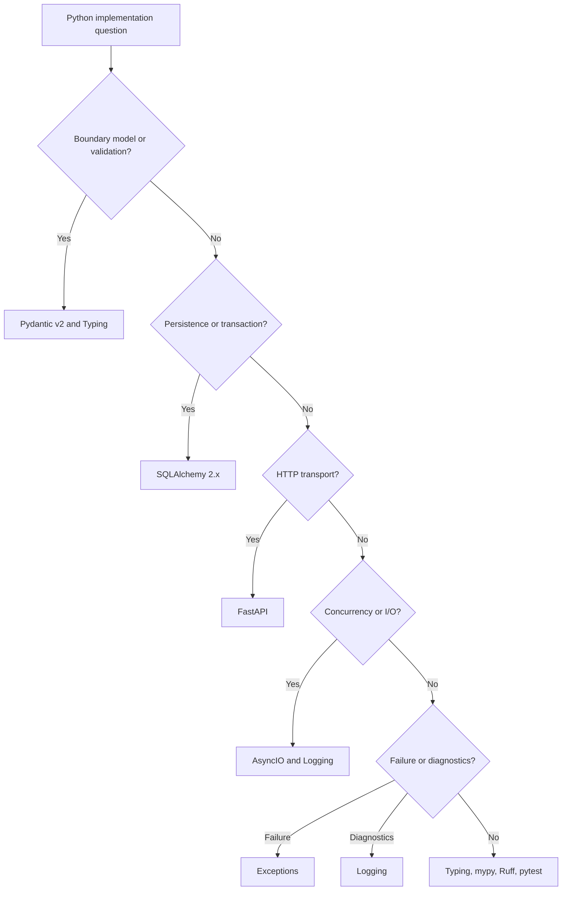

# Python Standards Index

Python standards define how backend agents write, refactor, test, type-check,
and operate Python code under the AI Engineering Operating System.

## Use This Index

Use this page when implementing or reviewing Python changes, especially when the
change touches API boundaries, persistence, async I/O, logging, exceptions,
tests, or type contracts.

## Severity Model

| Severity | Meaning | Required Action |
| --- | --- | --- |
| Critical | Issue can cause data loss, security exposure, production outage, or broken API contract. | Block completion or require formal exception. |
| High | Issue hides runtime failure, type drift, blocking I/O, unsafe persistence, or untestable behavior. | Fix in current phase when in scope, otherwise record debt. |
| Medium | Issue reduces maintainability, clarity, or reviewability in touched code. | Fix opportunistically or schedule targeted work. |
| Low | Local consistency or style concern. | Improve under Boy Scout Rule when safe. |

## Standards Catalog

| Standard | Use When | Common Findings |
| --- | --- | --- |
| [Python 3.13+](python313.md) | Choosing language features and baseline idioms. | Import side effects, weak path/time modeling |
| [Typing](typing.md) | Designing contracts and domain types. | `Any`, raw primitives, unstructured dictionaries |
| [mypy](mypy.md) | Validating type correctness. | Suppressed errors, untyped boundaries |
| [Ruff](ruff.md) | Formatting and linting changed code. | Unused imports, broad catches, style drift |
| [pytest](pytest.md) | Verifying behavior and regression risk. | Over-mocking, nondeterminism, implementation tests |
| [Exceptions](exceptions.md) | Modeling and translating failures. | Swallowed errors, leaked infrastructure details |
| [Logging](logging.md) | Making workflows diagnosable. | Secret leakage, noisy or missing logs |
| [AsyncIO](async.md) | Writing async workflows. | Blocking I/O, missing timeouts, unbounded tasks |
| [Pydantic v2](pydantic-v2.md) | Validating API and boundary schemas. | Domain logic in schemas, weak validation |
| [SQLAlchemy 2.x](sqlalchemy2.md) | Implementing persistence and transactions. | Session leakage, ORM-driven domain logic |
| [FastAPI](fastapi.md) | Building HTTP transport boundaries. | Routers with business logic, leaked internals |
| [pathlib](pathlib.md) | Handling filesystem paths. | String path joins, unsafe path traversal |

## Routing Decision Tree

## AI Guidance

- Start from architecture boundaries before choosing framework features.
- Keep Pydantic, FastAPI, SQLAlchemy, and external clients out of domain logic.
- Pair type contracts with tests for behavior that matters.
- Treat async, logging, and exception handling as production design, not
  afterthoughts.

## References

- Backend Engineer: `../agents/backend.md`
- Code Review: `../checklists/code-review.md`
- Architecture Constitution: `../architecture/constitution.md`
- Engineering Principles: `../engineering/README.md`
