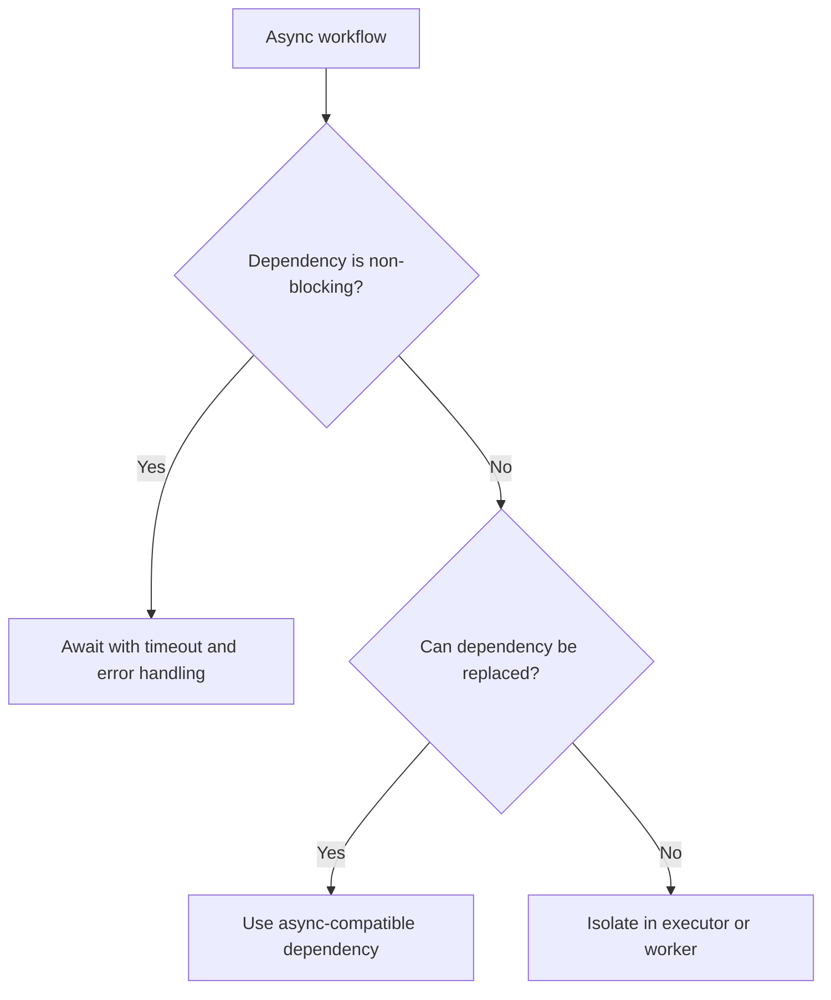

# AsyncIO

AsyncIO standards ensure asynchronous Python code is honest, non-blocking,
testable, and operationally safe.

## Philosophy

Async code should improve concurrency without hiding blocking work. False async
is worse than synchronous code because it creates capacity failures that are
hard to diagnose.

## Rules

- Do not call blocking I/O directly inside `async def`.
- Use async-compatible clients for databases, HTTP, queues, and storage when in
  async workflows.
- Isolate unavoidable blocking calls with executors or worker boundaries.
- Always set timeouts for remote calls.
- Make cancellation and cleanup safe for long-running tasks.
- Avoid unbounded task creation.
- Keep transaction and session lifetimes explicit.

## Bad Example

```python
async def upload(path: Path) -> None:
    requests.post("https://storage.example/upload", files={"file": path.open("rb")})
```

This blocks the event loop.

## Good Example

```python
async def upload(client: AsyncStorageClient, artifact: BackupArtifact) -> None:
    await client.upload(artifact, timeout_seconds=30)
```

The dependency is async and timeout-aware.

## Decision Tree



## AI Guidance

- Audit every I/O call inside async functions.
- Do not assume a library is async because the wrapper function is async.
- Use dependency injection so async clients can be faked in tests.
- Test timeout and cancellation behavior for important workflows.
- Keep background tasks observable and owned.

## Review Checklist

- No blocking I/O is hidden in async paths.
- Remote calls have timeouts.
- Task creation is bounded and supervised.
- Cleanup and cancellation are considered.
- Tests cover important async behavior and failures.

## References

- Architecture Constitution: `../architecture/constitution.md`
- Hidden Side Effects: `../smells/hidden-side-effects.md`
- Dependency Injection: `../engineering/dependency-injection.md`
- FastAPI Async: `../architecture/async.md`
