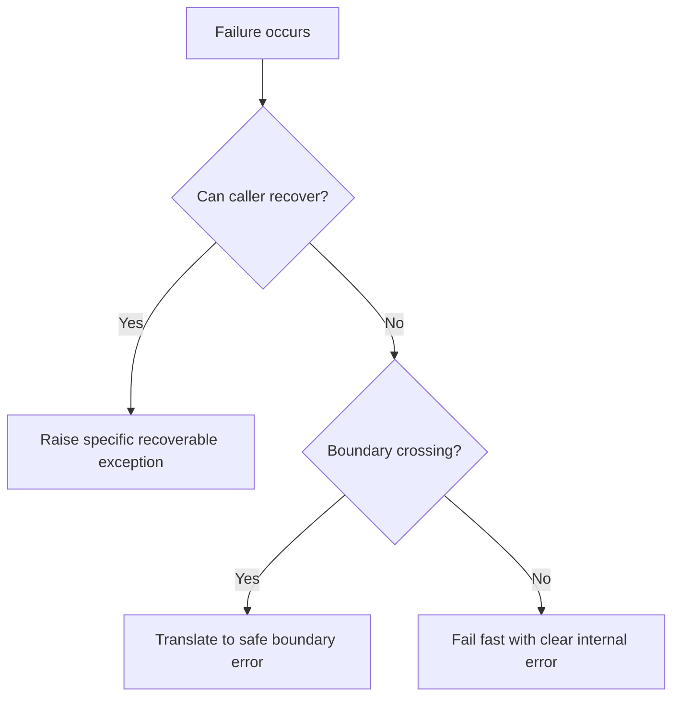

# Exceptions

Exceptions represent failure contracts. They must be explicit, actionable, and
safe to expose at the correct boundary.

## Philosophy

Good exception design keeps failure local and understandable. Bad exception
design hides failures, leaks infrastructure details, and makes recovery
impossible. Fail fast with clear errors, then translate them at boundaries.

## Rules

- Raise specific exceptions for meaningful failure categories.
- Preserve exception chains with `raise ... from exc`.
- Do not swallow exceptions silently.
- Do not expose secrets, credentials, SQL, or stack traces through public API
  responses.
- Translate infrastructure exceptions into application errors at boundaries.
- Use domain exceptions for violated business rules when callers can handle
  them meaningfully.

## Bad Example

```python
try:
    upload_backup(path)
except Exception:
    return False
```

The failure cause is lost.

## Good Example

```python
try:
    upload_backup(path)
except StorageClientError as exc:
    raise BackupStorageError("failed to store backup artifact") from exc
```

The caller receives a meaningful application error and the original cause is
preserved.

## Decision Tree



## AI Guidance

- Never use bare `except` or broad `except Exception` without a specific
  recovery or translation reason.
- Do not return `None` or `False` for exceptional failures unless the API
  explicitly models absence.
- Keep user-facing messages safe and operational logs diagnostic.
- Test important failure paths.

## Review Checklist

- Exception types communicate failure category.
- Exception chains are preserved.
- Broad catches have clear purpose.
- Public errors do not leak internals or secrets.
- Failure paths are tested.

## References

- Fail Fast: `../engineering/fail-fast.md`
- Security Engineer: `../agents/security.md`
- FastAPI Errors: `../fastapi/errors.md`
- Logging: `logging.md`
