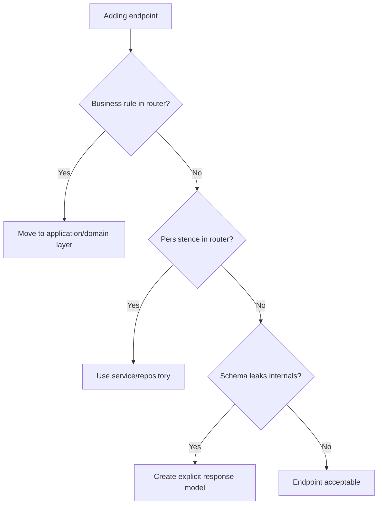

# FastAPI

FastAPI is the HTTP transport framework for Python services. It should expose
API contracts and compose dependencies at the edge, not host domain logic.

## Philosophy

Routers are adapters. They translate HTTP requests into application commands and
application results into HTTP responses. Keeping routers thin preserves Clean
Architecture and makes domain behavior testable without the web framework.

## Rules

- Keep routers thin: parse, authorize, call application service, map response.
- Use Pydantic v2 request and response models for contracts.
- Use FastAPI dependencies for edge composition, not as a service locator inside
  application or domain logic.
- Do not return ORM models directly.
- Translate application errors into safe HTTP errors.
- Keep authentication and authorization explicit.
- Version public APIs deliberately.

## Bad Example

```python
@router.post("/backups")
async def create_backup(request: CreateBackupRequest, session: Session = Depends(get_session)):
    record = BackupRecord(**request.model_dump())
    session.add(record)
    session.commit()
    return record
```

The router owns persistence and leaks ORM state.

## Good Example

```python
@router.post("/backups", response_model=CreateBackupResponse)
async def create_backup(
    request: CreateBackupRequest,
    service: CreateBackupService = Depends(get_create_backup_service),
) -> CreateBackupResponse:
    result = await service.create(request.to_command())
    return CreateBackupResponse.from_result(result)
```

The router maps HTTP to an application service.

## Decision Tree



## AI Guidance

- Treat FastAPI as a boundary adapter.
- Do not call `Depends` outside FastAPI composition points.
- Keep route functions short and boring.
- Use application errors and exception handlers for consistent responses.
- Test domain behavior below HTTP and API contracts at HTTP boundary.

## Review Checklist

- Router contains no substantial business logic.
- Request and response schemas are explicit.
- Dependencies are composed at the edge.
- ORM models and infrastructure exceptions do not leak to clients.
- Auth, validation, errors, and status codes are intentional.

## References

- Pydantic v2: `pydantic-v2.md`
- FastAPI routers: `../fastapi/routers.md`
- API Guidelines: `../architecture/api-guidelines.md`
- Architecture Constitution: `../architecture/constitution.md`
