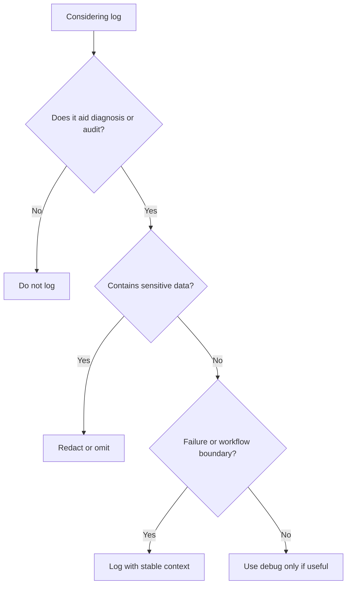

# Logging

Logging records operational facts that help diagnose behavior without exposing
sensitive data.

## Philosophy

Logs are part of observability. They should explain what happened, where, and
why it matters. Logs are not a substitute for errors, metrics, traces, audit
events, or tests.

## Rules

- Use structured logging where project infrastructure supports it.
- Include stable identifiers such as job ID, request ID, tenant ID, or backup ID
  when safe.
- Do not log secrets, tokens, passwords, full connection strings, or sensitive
  personal data.
- Log at the boundary of important workflows and failure translations.
- Avoid noisy logs inside tight loops.
- Use exception logging only when the current layer owns the failure or adds
  useful context.

## Bad Example

```python
logger.info("connecting with password=%s", password)
```

This exposes a secret.

## Good Example

```python
logger.info(
    "backup upload started",
    extra={"job_id": job_id, "destination_type": destination_type},
)
```

The log is useful without exposing credentials.

## Decision Tree



## AI Guidance

- Prefer context fields over interpolated prose when supported.
- Do not log and re-raise at every layer; avoid duplicate noise.
- Treat logs as production-facing documentation.
- Pair critical logs with metrics or audit events when operationally important.

## Review Checklist

- Logs have diagnostic value.
- Sensitive data is not logged.
- Important workflows have start, success, or failure visibility as needed.
- Exception logs are not duplicated across layers.
- Context fields are stable and safe.

## References

- Observability Rule: `../architecture/constitution.md`
- Security Engineer: `../agents/security.md`
- Exceptions: `exceptions.md`
- DevOps Agent: `../agents/devops.md`
