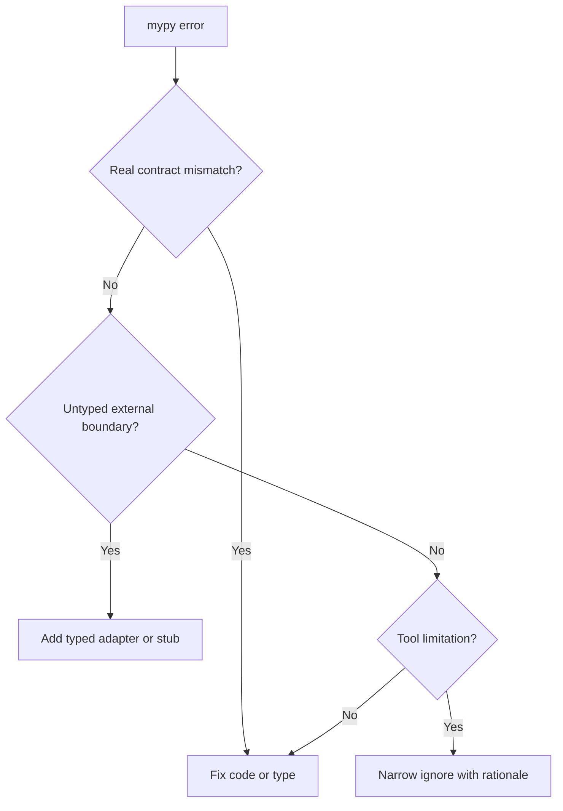

# mypy

mypy is the static type checker for Python modernization work. It verifies that
type contracts remain coherent as legacy code is refactored.

## Philosophy

Type checking is a quality gate, not a paperwork exercise. The purpose is to
catch contract drift early and make code safer to change. Strictness should
increase over time without blocking useful incremental modernization.

## Rules

- New or substantially changed code must be mypy-friendly.
- Do not add broad ignores such as file-level `ignore_errors`.
- Use narrow `# type: ignore[code]` only with rationale.
- Prefer fixing types at boundaries over suppressing errors.
- Treat `Any` propagation as a design smell.
- Keep third-party untyped boundaries isolated behind typed adapters.

## Bad Example

```python
from typing import Any


def load_job(raw: Any) -> Any:
    return raw["job"]
```

This defeats type checking.

## Good Example

```python
from typing import TypedDict


class JobPayload(TypedDict):
    job: str


def load_job(raw: JobPayload) -> str:
    return raw["job"]
```

The boundary contract is checkable.

## Decision Tree



## AI Guidance

- Do not suppress errors to make checks green.
- Prefer smaller typed adapters around dynamic libraries.
- When modernizing legacy files, improve type coverage in touched code.
- Explain unavoidable ignores in comments or debt records.

## Review Checklist

- Changed code has meaningful annotations.
- Ignores are narrow and justified.
- `Any` does not leak into domain or application logic.
- Untyped dependencies are isolated.
- Type changes are backed by tests where behavior is important.

## References

- Typing: `typing.md`
- Code Review: `../checklists/code-review.md`
- Dependency Injection: `../engineering/dependency-injection.md`
- Backend Engineer: `../agents/backend.md`
