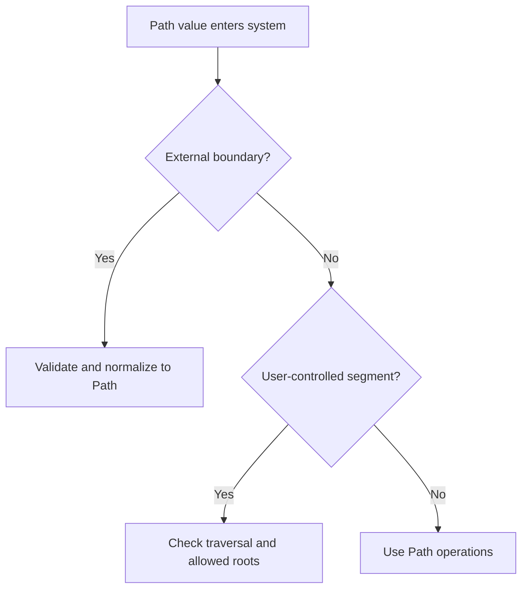

# pathlib

`pathlib.Path` is the standard for filesystem path handling in Python code.

## Philosophy

Paths are structured values, not arbitrary strings. Using `Path` makes path
composition, normalization, file operations, and tests clearer and safer.

## Rules

- Use `Path` for filesystem paths in Python APIs.
- Accept `Path` or `str | Path` at external boundaries, then normalize to
  `Path`.
- Do not build paths with string concatenation.
- Keep path traversal and user-provided path validation explicit.
- Use temporary directories for tests and avoid hard-coded absolute paths.
- Do not perform filesystem side effects at import time.

## Bad Example

```python
def artifact_path(root: str, job_id: str) -> str:
    return root + "/" + job_id + "/artifact.zip"
```

The code is platform-sensitive and stringly typed.

## Good Example

```python
from pathlib import Path


def artifact_path(root: Path, job_id: str) -> Path:
    return root / job_id / "artifact.zip"
```

The path operation is explicit.

## Decision Tree



## AI Guidance

- Do not concatenate path strings.
- Treat user-provided paths as untrusted input.
- Keep filesystem adapters injectable for tests.
- Use `tmp_path` in pytest tests.
- Prefer returning `Path` until serialization boundary requires a string.

## Review Checklist

- Path APIs use `Path`.
- User-controlled paths are validated.
- Tests use temporary paths.
- No import-time filesystem side effects exist.
- Serialization to string happens only at boundaries.

## References

- Python 3.13+: `python313.md`
- pytest: `pytest.md`
- Security Engineer: `../agents/security.md`
- Hidden Side Effects: `../smells/hidden-side-effects.md`
