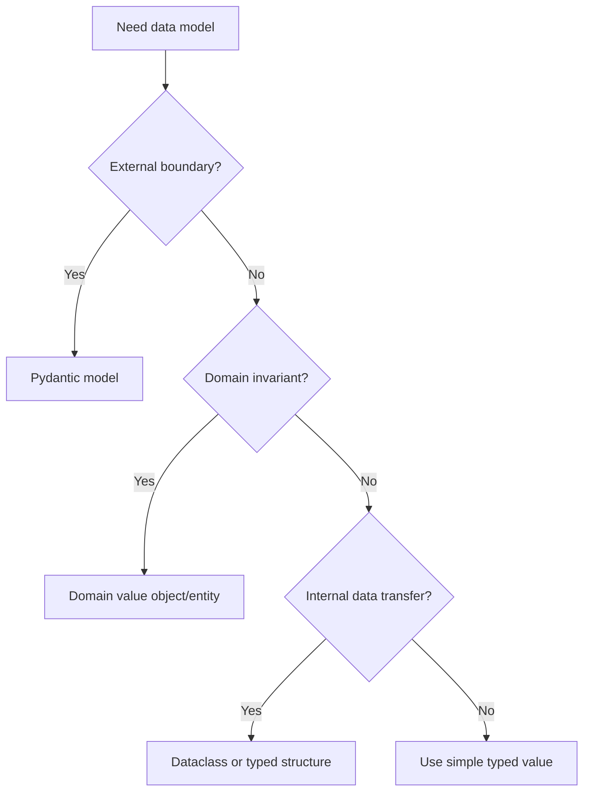

# Pydantic v2

Pydantic v2 is the standard for validating and serializing boundary data in
FastAPI and integration code. It is not the default domain model.

## Philosophy

Boundary schemas protect the system from malformed input and produce stable API
contracts. Domain objects protect business invariants. These responsibilities
often overlap but should not be confused.

## Rules

- Use Pydantic models for request, response, settings, and external payload
  validation.
- Keep domain behavior in domain objects or application services.
- Use `model_config = ConfigDict(extra="forbid")` for inputs unless extension is
  deliberate.
- Use field validators for boundary normalization, not broad business workflows.
- Map boundary models into commands, value objects, or domain types where
  invariants matter.
- Do not expose ORM models as response schemas.

## Bad Example

```python
class CreateBackupRequest(BaseModel):
    job_id: str
    retention_days: int

    def run_backup(self) -> None:
        ...
```

The request schema owns business workflow.

## Good Example

```python
from pydantic import BaseModel, ConfigDict, Field


class CreateBackupRequest(BaseModel):
    model_config = ConfigDict(extra="forbid")

    job_id: str
    retention_days: int = Field(ge=1, le=365)

    def to_command(self, requested_by: str) -> CreateBackupCommand:
        return CreateBackupCommand(
            job_id=self.job_id,
            retention=RetentionDays(self.retention_days),
            requested_by=requested_by,
        )
```

The schema validates the boundary and maps inward.

## Decision Tree



## AI Guidance

- Do not put database access, external calls, or orchestration in Pydantic
  models.
- Use clear schema names: `Request`, `Response`, `Payload`, `Settings`.
- Avoid `dict[str, Any]` for known payloads.
- Keep response schemas stable and explicit.
- Validate at boundaries, then rely on typed domain objects internally.

## Review Checklist

- Boundary inputs reject unexpected fields unless intentionally extensible.
- Schemas do not expose ORM models or infrastructure details.
- Domain invariants are not scattered across schemas.
- Mapping from schema to command/domain object is explicit.
- Error messages are useful and safe.

## References

- Typing: `typing.md`
- FastAPI: `fastapi.md`
- Primitive Obsession: `../smells/primitive-obsession.md`
- Architecture Constitution: `../architecture/constitution.md`
