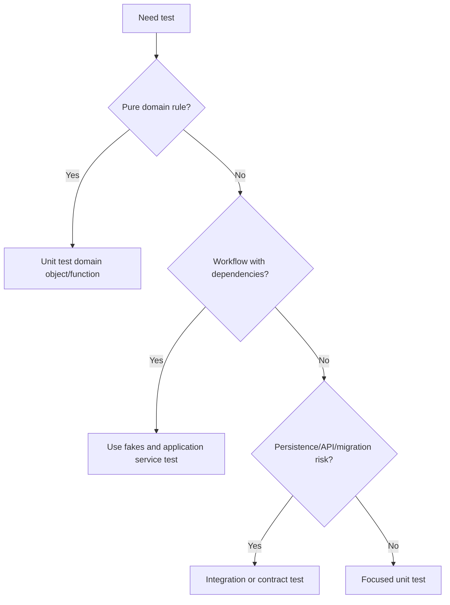

# pytest

pytest is the default test framework for Python modernization work. Tests must
prove behavior, protect refactors, and expose risk.

## Philosophy

Legacy modernization needs confidence. Tests should describe expected behavior
and failure modes, not freeze incidental implementation details. A good test
lets agents change structure without changing behavior.

## Rules

- Test domain rules directly.
- Test application workflows through explicit dependencies and fakes.
- Use integration tests for persistence, migrations, and API contracts when
  unit tests cannot prove the risk.
- Keep tests deterministic by injecting clocks, randomness, and side effects.
- Use fixtures for meaningful shared setup, not to hide test intent.
- Avoid over-mocking internals.

## Bad Example

```python
def test_service_calls_private_method(mocker):
    service = BackupService()
    spy = mocker.spy(service, "_do_backup")
    service.run()
    spy.assert_called_once()
```

This freezes implementation instead of behavior.

## Good Example

```python
def test_backup_is_stored_after_successful_run(storage: FakeStorage) -> None:
    service = BackupService(executor=SuccessfulExecutor(), storage=storage)

    result = service.run(command)

    assert result.location == storage.saved_location
```

The test verifies observable behavior.

## Decision Tree



## AI Guidance

- Add characterization tests before risky legacy refactors.
- Prefer fakes over patching hidden globals.
- Name tests by behavior and expected outcome.
- Keep one clear reason for a test to fail.
- If tests cannot be written cleanly, investigate architecture seams.

## Review Checklist

- Acceptance criteria map to tests or verification.
- Tests assert behavior and failure modes.
- Tests are deterministic.
- Fixtures improve readability.
- Important risks have appropriate test level.
- No test relies on private implementation unless unavoidable and documented.

## References

- QA Engineer: `../agents/qa.md`
- Testing Loop: `../loops/testing.md`
- Code Review: `../checklists/code-review.md`
- Hidden Side Effects: `../smells/hidden-side-effects.md`
