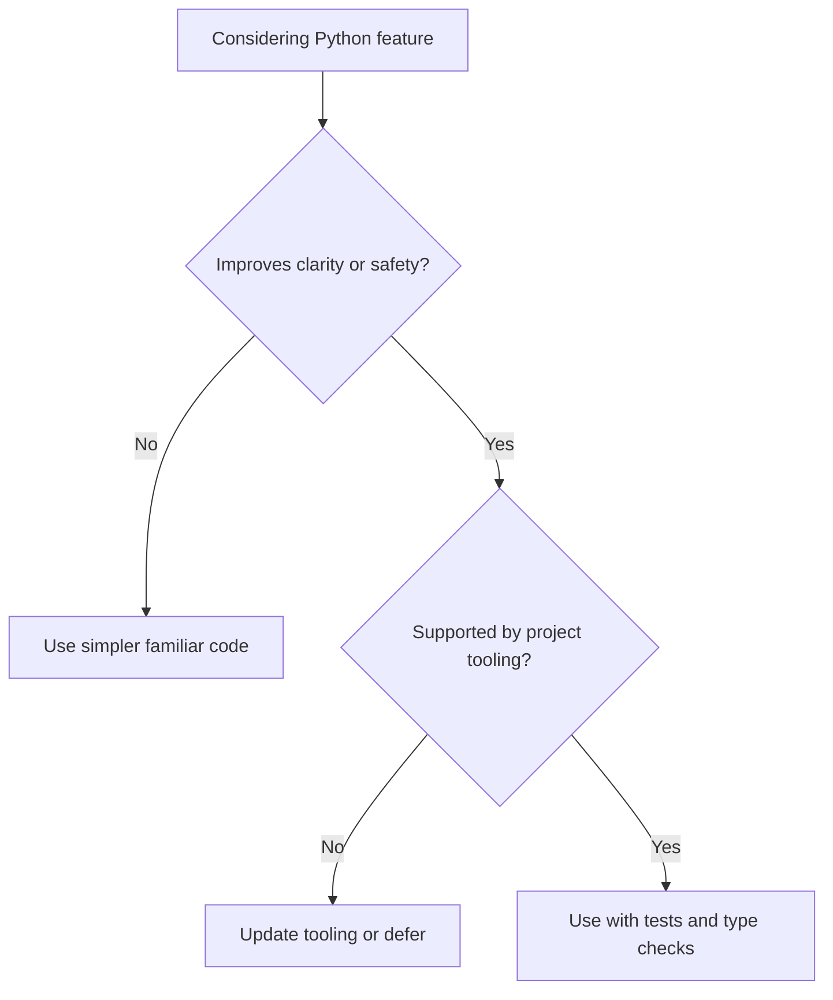

# Python 3.13+

Python 3.13+ is the baseline language version for AI-OS modernization. Code
must use modern Python features deliberately, not cosmetically.

## Philosophy

Modern Python should make behavior clearer, safer, and easier to test. The goal
is not to use every new feature. The goal is to write explicit, typed,
maintainable backend code that aligns with Clean Architecture, dependency
injection, and observability standards.

## Rules

- Use Python 3.13+ syntax and standard library features when they improve
  clarity.
- Prefer `pathlib.Path` over string path manipulation.
- Prefer `dataclass(frozen=True)` or domain value objects for immutable domain
  concepts.
- Use `StrEnum` for stable string status values and wire-compatible categories.
- Use `zoneinfo` and timezone-aware datetimes for business time.
- Avoid module-level side effects during import.
- Keep framework, persistence, and environment access at boundaries.

## Bad Example

```python
def backup_path(root, job_id):
    return root + "/" + job_id + "/" + "backup.zip"
```

This relies on string path composition and untyped inputs.

## Good Example

```python
from pathlib import Path


def backup_path(root: Path, job_id: str) -> Path:
    return root / job_id / "backup.zip"
```

The path behavior is explicit and portable.

## Decision Tree



## AI Guidance

- Do not introduce clever syntax to make generated code look modern.
- Prefer explicit names and types over dynamic tricks.
- Avoid import-time I/O, environment reads, client construction, or registry
  mutation.
- Use standard library features before adding dependencies.

## Review Checklist

- Code uses Python 3.13+ idioms for clarity.
- Paths, datetimes, enums, and immutable values are modeled explicitly.
- Imports do not trigger side effects.
- Standard library solutions are preferred where sufficient.
- Type checking and tests support the chosen constructs.

## References

- Typing: `typing.md`
- Pathlib: `pathlib.md`
- Exceptions: `exceptions.md`
- Architecture Constitution: `../architecture/constitution.md`
