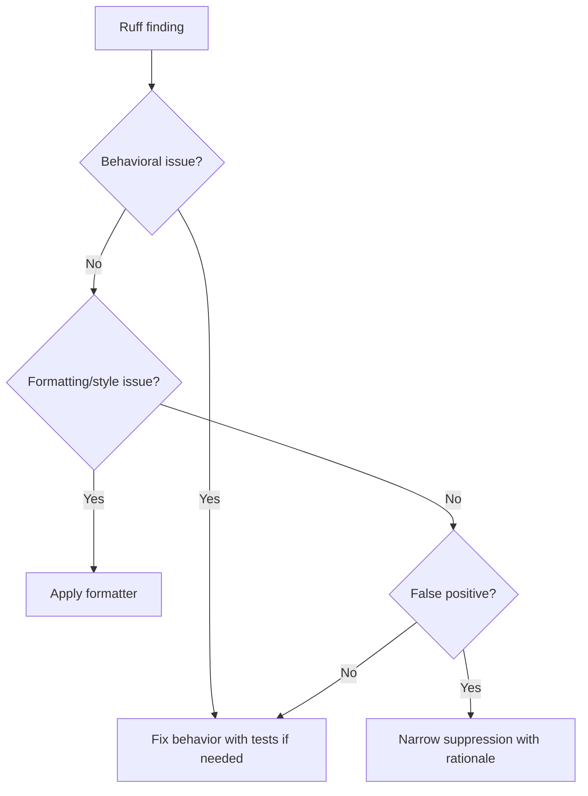

# Ruff

Ruff is the linting and formatting baseline for Python modernization work. It
keeps code consistent and catches common defects cheaply.

## Philosophy

Linting should remove noise from review so humans and AI agents can focus on
behavior, architecture, and risk. Ruff findings should be addressed by improving
code, not by piling on suppressions.

## Rules

- Run Ruff formatting and linting where project configuration exists.
- Do not introduce unused imports, dead code, broad exception catches, or
  inconsistent formatting.
- Keep suppressions narrow and documented.
- Prefer project-level configuration over per-file inconsistency.
- Do not fight the formatter for personal style.

## Bad Example

```python
import os
import sys


def run():
    try:
        do_work()
    except Exception:
        pass
```

Unused imports and swallowed exceptions hide problems.

## Good Example

```python
def run() -> None:
    try:
        do_work()
    except BackupError as exc:
        raise RuntimeError("backup failed") from exc
```

The code is focused and failure is explicit.

## Decision Tree



## AI Guidance

- Let Ruff handle mechanical formatting.
- Avoid churn outside touched files unless the task is formatting-only.
- Do not hide lint findings with broad `noqa`.
- Treat lint findings about exceptions, complexity, and unused code as design
  signals.

## Review Checklist

- Changed code is formatted consistently.
- Suppressions are narrow and justified.
- No unused imports or dead code were introduced.
- Exception and complexity findings were reviewed, not blindly suppressed.
- Ruff changes do not obscure functional changes.

## References

- Exceptions: `exceptions.md`
- Dead Code: `../smells/dead-code.md`
- Code Review: `../checklists/code-review.md`
- Boy Scout Rule: `../engineering/boy-scout-rule.md`
