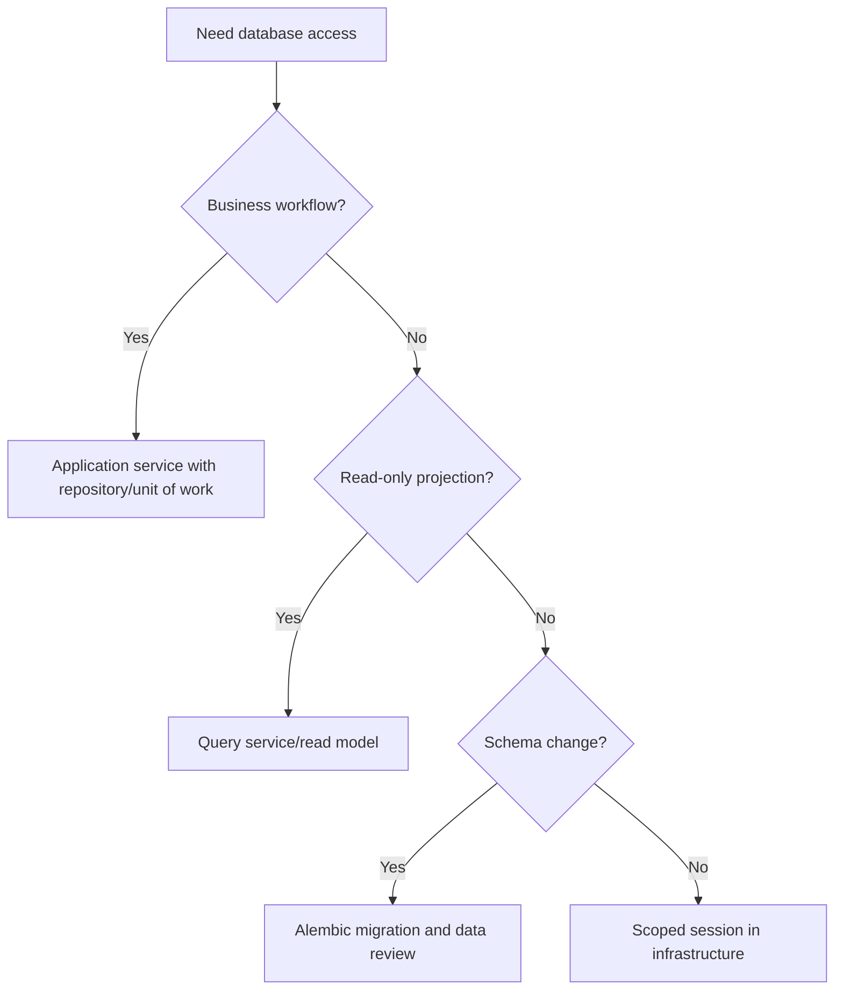

# SQLAlchemy 2.x

SQLAlchemy 2.x is the persistence toolkit for Python modernization work.
Persistence must support domain behavior without becoming the architecture.

## Philosophy

Database code is an implementation detail with real operational consequences.
SQLAlchemy models can represent persistence structure, but they should not
accidentally become the only domain model when business behavior matters.

## Rules

- Use SQLAlchemy 2.x style APIs and explicit sessions.
- Keep session lifetime scoped to a unit of work, request, job, or transaction.
- Do not create sessions inside domain objects.
- Do not leak ORM models through API responses.
- Prefer repositories or query services when persistence details would couple
  application logic to SQLAlchemy.
- Make transaction boundaries explicit.
- Pair schema changes with Alembic migrations and operational notes.

## Bad Example

```python
class Backup:
    def mark_complete(self) -> None:
        session = SessionLocal()
        self.status = "complete"
        session.commit()
```

The domain object owns persistence and transaction behavior.

## Good Example

```python
class BackupRepository:
    def __init__(self, session: Session) -> None:
        self._session = session

    def save(self, backup: Backup) -> None:
        record = BackupRecord.from_domain(backup)
        self._session.merge(record)
```

Persistence is explicit and injectable.

## Decision Tree



## AI Guidance

- Keep ORM imports out of domain logic.
- Avoid lazy-loading surprises across layers.
- Prefer explicit queries over hidden relationship traversal in business logic.
- Review N+1 risk and indexes for changed query paths.
- Treat migrations as deployment work, not just code.

## Review Checklist

- Session and transaction lifetimes are explicit.
- ORM models do not leak through API or domain boundaries.
- Repositories or query services hide persistence where useful.
- Queries have appropriate indexes and loading strategy.
- Migrations include safety and rollback or mitigation notes.

## References

- Persistence: `../architecture/persistence.md`
- Database Engineer: `../agents/database.md`
- Architecture Constitution: `../architecture/constitution.md`
- Alembic guidance: `../checklists/deployment.md`
