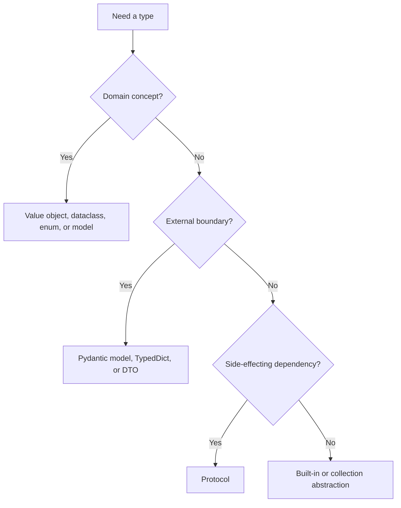

# Typing

Typing makes Python contracts visible to humans, tools, and AI agents. Types are
part of design documentation and review evidence.

## Philosophy

Types should reveal intent, prevent common mistakes, and support safe
refactoring. They are not decorative. A misleading type annotation is worse than
none because it creates false confidence.

## Rules

- Annotate public functions, methods, constructors, and non-obvious variables.
- Prefer precise domain types over `dict`, `list`, `str`, and `Any`.
- Use `Protocol` for side-effecting boundaries when replacement or tests need a
  stable contract.
- Use `TypedDict`, dataclasses, Pydantic models, or value objects instead of
  unstructured dictionaries.
- Avoid `Any` unless the boundary is genuinely dynamic and documented.
- Use `Sequence`, `Mapping`, and other abstract collection types for inputs
  when mutation is not required.
- Return concrete types when callers rely on concrete behavior.

## Bad Example

```python
def create_job(data):
    return {"id": data["id"], "status": "queued"}
```

The contract is invisible and unsafe.

## Good Example

```python
from dataclasses import dataclass
from enum import StrEnum


class JobStatus(StrEnum):
    QUEUED = "queued"


@dataclass(frozen=True)
class CreateJobCommand:
    job_id: str


@dataclass(frozen=True)
class CreatedJob:
    job_id: str
    status: JobStatus


def create_job(command: CreateJobCommand) -> CreatedJob:
    return CreatedJob(job_id=command.job_id, status=JobStatus.QUEUED)
```

The domain contract is explicit.

## Decision Tree



## AI Guidance

- Do not silence type errors with `Any` or `cast` until the contract is
  understood.
- If a function takes several primitives, consider a command or value object.
- Keep Pydantic schemas at boundaries when domain invariants need independent
  domain types.
- Use protocols sparingly for real boundaries.

## Review Checklist

- Public APIs are typed.
- Important domain concepts are not raw primitives.
- `Any` usage is justified and contained.
- Protocols represent behavior, not implementation details.
- Types align with runtime validation and tests.

## References

- mypy: `mypy.md`
- Pydantic v2: `pydantic-v2.md`
- Primitive Obsession: `../smells/primitive-obsession.md`
- Dependency Injection: `../engineering/dependency-injection.md`
