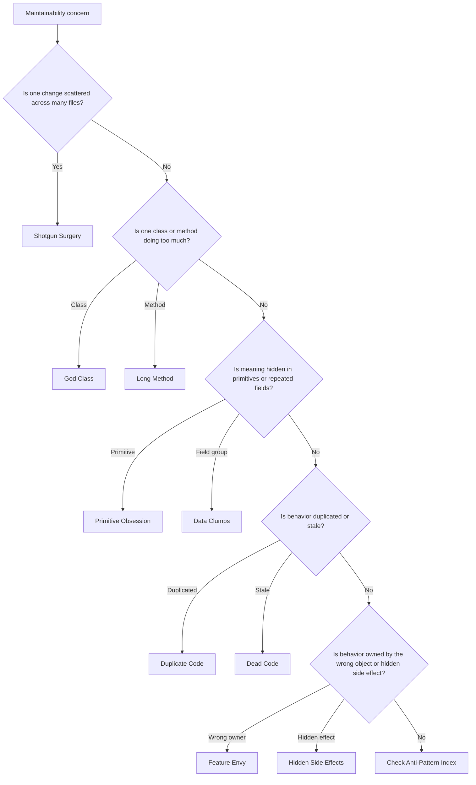

# Code Smell Review Index

Code smells are signs that code may be harder to understand, test, change, or
review than necessary. A smell is not automatically a defect. It becomes a
finding when it increases risk for the current goal or creates recurring
modernization cost.

## Use This Index

Use this page during code review, legacy analysis, refactoring planning, and
maintainability triage.

## Severity Model

| Severity | Meaning | Required Action |
| --- | --- | --- |
| Critical | Smell hides security, data integrity, or production failure risk. | Block until fixed or accepted by responsible role. |
| High | Smell causes frequent defects, unsafe change amplification, or poor testability in active code. | Fix in current phase when in scope; otherwise record debt. |
| Medium | Smell slows change or obscures behavior but is locally contained. | Fix when touching the area or schedule targeted refactor. |
| Low | Readability issue with limited risk. | Improve opportunistically. |

## Completed Smells

| Smell | Primary Signal | Default Severity | First Response |
| --- | --- | --- | --- |
| [Duplicate Code](duplicate-code.md) | Same rule or workflow appears in multiple places. | Medium | Identify shared knowledge before extracting. |
| [Long Method](long-method.md) | One method mixes workflow, validation, I/O, and formatting. | Medium | Extract named responsibilities and preserve behavior. |
| [God Class](god-class.md) | One class has many unrelated reasons to change. | High | Split by responsibility, layer, and bounded context. |
| [Primitive Obsession](primitive-obsession.md) | Important concepts represented as raw strings, ints, dicts, or booleans. | Medium | Introduce value objects, enums, commands, or policies. |
| [Hidden Side Effects](hidden-side-effects.md) | Code mutates state, performs I/O, or depends on time/randomness unexpectedly. | High | Separate pure logic and inject side-effecting collaborators. |
| [Data Clumps](data-clumps.md) | Field groups travel together repeatedly. | Medium | Name the composite concept and centralize invariants. |
| [Dead Code](dead-code.md) | Code is no longer reachable, configured, or supported. | Medium | Remove with evidence or record uncertainty. |
| [Feature Envy](feature-envy.md) | Code makes decisions using another object's internals. | Medium | Move behavior toward the owner of the invariant. |
| [Shotgun Surgery](shotgun-surgery.md) | One conceptual change requires scattered edits. | High | Identify the missing owner, policy, or variation point. |

## Routing Decision Tree

## Review Rules

- Tie every smell finding to a concrete risk: testability, correctness,
  security, performance, reviewability, or change amplification.
- Do not refactor smells outside the task unless they block safe completion or
  are low-risk Boy Scout improvements.
- Prefer behavior-preserving tests before structural refactors.
- Use Project Brain for recurring smell patterns that indicate missing domain
  concepts or architectural debt.

## AI Guidance

- Classify the smell before changing code.
- Avoid mechanical refactors that improve metrics while reducing clarity.
- Preserve public behavior unless the goal explicitly changes it.
- Escalate when a smell reveals an architecture violation.

## References

- Anti-Pattern Review Index: `../anti-patterns/README.md`
- Code Review Checklist: `../checklists/code-review.md`
- Architecture Review Checklist: `../checklists/architecture-review.md`
- Refactoring: `../clean-code/refactoring.md`
