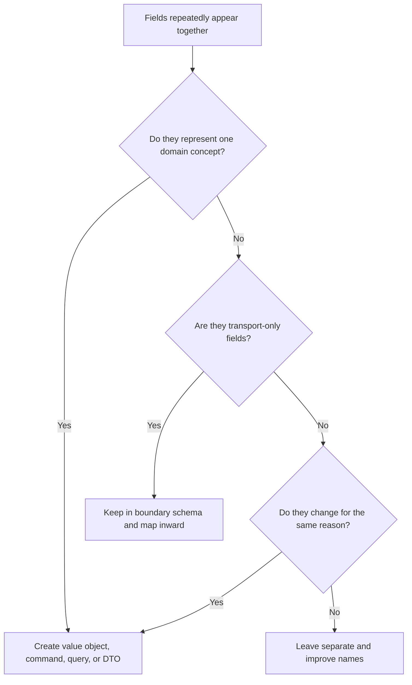

# Data Clumps

Data clumps are groups of fields that repeatedly appear together across
functions, classes, APIs, queries, or tests. They usually signal a missing
domain concept.

## Philosophy

Values that travel together often change together and should often be named
together. A data clump is not just untidy parameter passing. It is lost meaning:
the system knows the fields belong together, but the code refuses to name the
thing they represent.

## Explanation

Common data clumps:

- `start_date`, `end_date`, and timezone repeated across queries;
- `host`, `port`, `username`, and password passed through backup code;
- `amount`, `currency`, and precision handled separately;
- `street`, `city`, `country`, and postal code repeated in APIs;
- `limit`, `offset`, and sort parameters copied across endpoints;
- `user_id`, `tenant_id`, and role strings repeated across authorization calls.

Data clumps are related to primitive obsession. Primitive obsession hides the
meaning of one concept; data clumps hide the meaning of a composite concept.

## Bad Example

```python
def list_backups(start_date: date, end_date: date, timezone: str) -> list[Backup]:
    ...


def export_backups(start_date: date, end_date: date, timezone: str) -> bytes:
    ...
```

The repeated fields likely represent a reporting period.

## Good Example

```python
from dataclasses import dataclass
from datetime import date


@dataclass(frozen=True)
class ReportingPeriod:
    start_date: date
    end_date: date
    timezone: str

    def __post_init__(self) -> None:
        if self.end_date < self.start_date:
            raise ValueError("reporting period end date must not precede start date")


def list_backups(period: ReportingPeriod) -> list[Backup]:
    ...


def export_backups(period: ReportingPeriod) -> bytes:
    ...
```

The validation and meaning now have one owner.

## Decision Tree



## Refactoring Strategies

- Extract value objects for domain concepts with invariants.
- Extract command or query objects for application use cases.
- Extract Pydantic request models at FastAPI boundaries and map them to domain
  concepts when rules matter.
- Replace long parameter lists with named objects only when the grouped data has
  meaning.
- Move validation from call sites into the new concept.

## AI Guidance

- Do not create generic bags such as `Context`, `Params`, or `Data` without a
  precise name.
- Look for repeated validation next to repeated fields; it confirms a missing
  concept.
- Preserve API compatibility by mapping old wire fields into the new internal
  object when needed.
- Add boundary tests for invalid combinations, not only invalid individual
  fields.

## Review Checklist

- Repeated field groups have been evaluated for domain meaning.
- Extracted objects enforce their own invariants.
- Names come from business or operational language.
- Transport schemas and domain value objects have distinct responsibilities.
- The refactor reduces parameter noise without hiding unrelated data.
- Tests cover valid and invalid field combinations.

## References

- Primitive Obsession: `primitive-obsession.md`
- Value Objects: `../domain/value-objects.md`
- Pydantic v2: `../python/pydantic-v2.md`
- Domain Invariants: `../domain/invariants.md`
