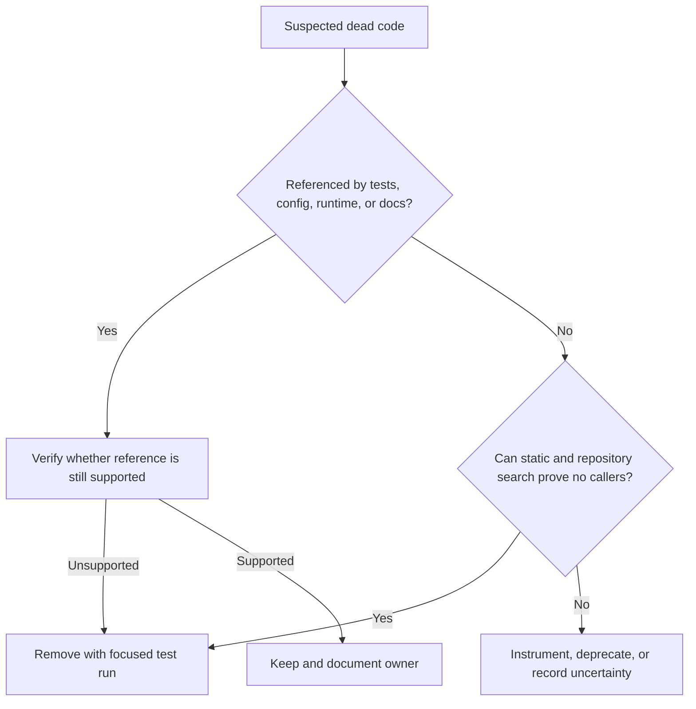

# Dead Code

Dead code is code that is no longer executed, no longer reachable, no longer
configured, or no longer needed to satisfy current product and operational
goals.

## Philosophy

Dead code is not harmless. It creates false options, expands review surface,
confuses AI agents, hides security risk, and makes modernization slower because
every unused branch appears to be a behavior that might need preservation.

The standard is evidence-based removal. Do not delete code just because it looks
old; prove it is unused or make the uncertainty explicit.

## Explanation

Dead code includes:

- unused functions, classes, modules, imports, and constants;
- unreferenced feature flags and configuration branches;
- obsolete migrations or scripts not used by supported environments;
- code paths for unsupported database engines, destinations, or API versions;
- commented-out code;
- tests for behavior that no longer exists;
- duplicate compatibility layers after migration is complete.

## Bad Example

```python
def upload_to_legacy_storage(path: str) -> None:
    # Kept in case we need the old provider again.
    ...
```

The code is retained without owner, trigger, test, or supported use case.

## Good Example

```markdown
## Removal Record

- Removed: legacy storage upload adapter.
- Evidence: no configuration references, no runtime metrics for 90 days, no
  supported customers use provider.
- Replacement: `S3StorageAdapter`.
- Rollback: restore from commit `abc123` if a contractual dependency is found.
```

Removal is paired with evidence and recovery path.

## Decision Tree



## Refactoring Strategies

- Use `rg`, static analysis, import graphs, and runtime telemetry where
  available.
- Remove commented-out code immediately; Git history is the archive.
- Delete unused imports and constants when tooling proves they are unused.
- Replace obsolete compatibility branches with explicit deprecation records
  before deletion when customer impact is uncertain.
- Remove tests that only preserve deleted behavior, and add tests that prove the
  replacement path.

## AI Guidance

- Never preserve dead code "just in case" without a documented owner and review
  trigger.
- Be cautious with dynamic imports, plugin loading, reflection, CLI entrypoints,
  and scheduled jobs; static search may miss them.
- When unsure, record the uncertainty in Project Brain instead of inventing a
  guarantee.
- Keep deletions scoped and reviewable.

## Review Checklist

- Evidence supports that the code is unused or unsupported.
- Dynamic entrypoints and configuration references were checked.
- Deletion does not remove active tests, scripts, or operational paths.
- Replacement behavior is tested when applicable.
- Any retained uncertain code has owner, risk, and review trigger.
- Project Brain debt or lessons were updated if the dead code indicates process
  failure.

## References

- Boy Scout Rule: `../engineering/boy-scout-rule.md`
- YAGNI: `../engineering/yagni.md`
- Project Brain: `../brain/README.md`
- Code Review Checklist: `../checklists/code-review.md`
