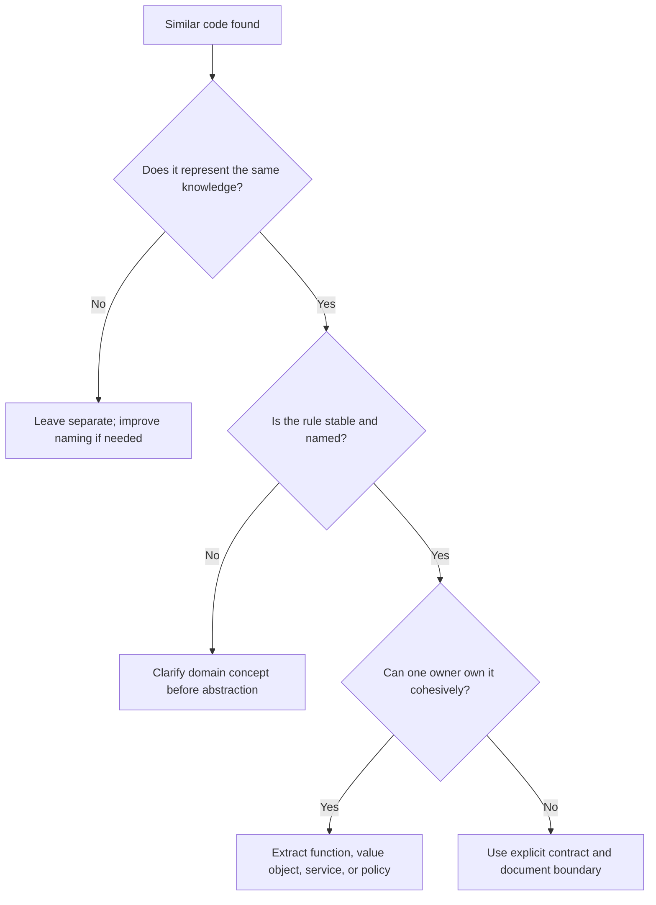

# Duplicate Code

Duplicate code is repeated logic, structure, policy, or workflow that must be
changed in multiple places to preserve one behavior.

## Philosophy

DRY means every piece of knowledge has one authoritative representation. It does
not mean every similar-looking line must be abstracted. Duplication is harmful
when it duplicates decisions, business rules, error handling, security checks,
or integration behavior. Premature abstraction is harmful when it hides
differences that matter.

## Explanation

Types of duplication:

- exact duplication: copied blocks of code;
- semantic duplication: different code implementing the same rule;
- structural duplication: repeated workflow shape with small variations;
- test duplication: repeated setup that obscures behavior;
- documentation duplication: copied standards that drift from the source of
  truth.

Legacy modernization should remove semantic duplication first because it creates
behavior drift.

## Bad Example

```python
def create_user(email: str) -> None:
    if "@" not in email or len(email) > 254:
        raise ValueError("invalid email")
    ...


def invite_user(email: str) -> None:
    if "@" not in email or len(email) > 254:
        raise ValueError("invalid email")
    ...
```

The email rule can drift between workflows.

## Good Example

```python
from dataclasses import dataclass


@dataclass(frozen=True)
class EmailAddress:
    value: str

    def __post_init__(self) -> None:
        if "@" not in self.value or len(self.value) > 254:
            raise ValueError("invalid email address")


def create_user(email: EmailAddress) -> None:
    ...


def invite_user(email: EmailAddress) -> None:
    ...
```

The rule has one owner and a domain name.

## Decision Tree



## Refactoring Strategies

- Extract domain value objects for repeated validation.
- Extract application services for repeated workflows.
- Extract small pure functions for repeated calculations.
- Use template method only when inheritance is already justified; prefer
  composition and strategy.
- Replace copied tests with fixtures only when the fixture improves readability.
- Link documentation to the source of truth instead of copying policy.

## AI Guidance

- Do not abstract accidental similarity before understanding variation.
- Prefer names from the ubiquitous language over generic helpers.
- Avoid `utils.py` as the destination for duplicated business behavior.
- When duplication exists across bounded contexts, verify whether it is truly
  the same rule before centralizing it.

## Review Checklist

- Repeated business rules have one authoritative owner.
- Abstractions preserve meaningful differences.
- Extracted code is cohesive and named by purpose.
- Tests cover the shared behavior once and important callers separately.
- No generic helper module became a dumping ground.
- Documentation links to source-of-truth standards.

## References

- DRY: `../engineering/dry.md`
- High Cohesion and Low Coupling: `../engineering/high-cohesion-low-coupling.md`
- Value Objects: `../domain/value-objects.md`
- Refactoring: `../clean-code/refactoring.md`
