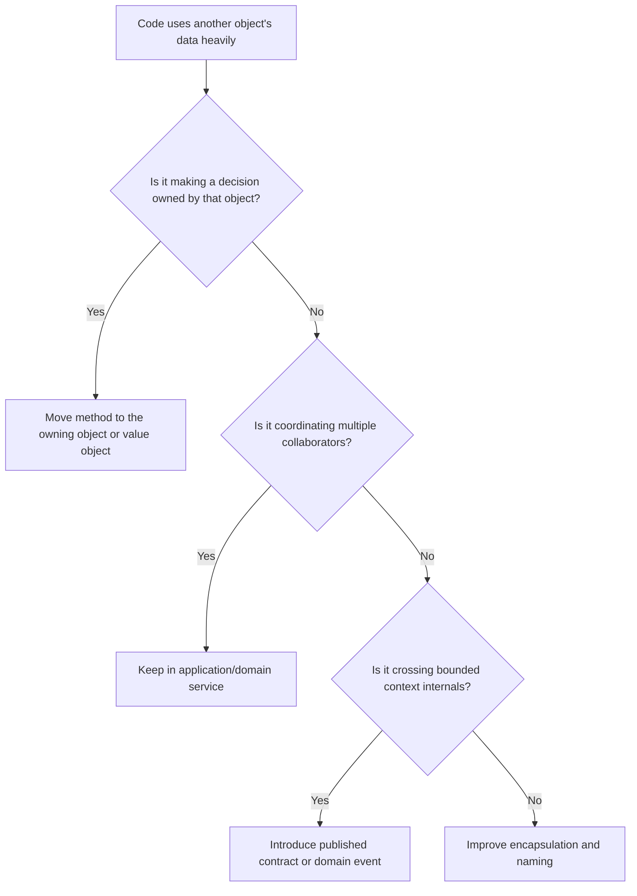

# Feature Envy

Feature envy occurs when one class, function, or module spends more effort using
another object's data than its own. It often means behavior is attached to the
wrong owner.

## Philosophy

Behavior should live near the data and invariants it protects. Feature envy
breaks encapsulation by pulling decisions out of the object or concept that has
the context to make them. The result is procedural code wrapped around passive
data.

This smell must be handled carefully. Sometimes application services properly
coordinate multiple objects. The problem is envy, not collaboration.

## Explanation

Signals:

- repeated chains such as `order.customer.account.status`;
- service methods reading many attributes from an entity to make a domain
  decision;
- utility functions that calculate business state from raw object fields;
- modules in one bounded context manipulating another context's internals;
- tests that verify state by reaching deeply into collaborators.

## Bad Example

```python
class DiscountService:
    def discount_for(self, customer: Customer) -> int:
        if customer.account.status == "gold" and customer.account.years_active >= 3:
            return 15
        return 0
```

The discount rule knows too much about the customer's internal structure.

## Good Example

```python
class Customer:
    def loyalty_discount_percent(self) -> int:
        if self.account.is_gold_for_at_least(years=3):
            return 15
        return 0


class DiscountService:
    def discount_for(self, customer: Customer) -> int:
        return customer.loyalty_discount_percent()
```

The decision moved toward the owner of the relevant data.

## Decision Tree



## Refactoring Strategies

- Move methods to the entity or value object that owns the invariant.
- Extract domain services only when behavior genuinely spans multiple domain
  objects.
- Replace data access chains with intention-revealing methods.
- Introduce query models or read models for reporting code that legitimately
  projects data.
- Strengthen aggregate boundaries so external code cannot mutate internals.

## AI Guidance

- Do not move orchestration into entities just to eliminate every service.
- Ask who owns the invariant before moving behavior.
- Treat long attribute chains as a Law of Demeter warning.
- In DDD code, avoid crossing bounded context internals to satisfy a local
  feature.

## Review Checklist

- Business decisions live near the data and invariants they depend on.
- Application services coordinate rather than inspect internals.
- Attribute chains are replaced with intention-revealing methods where useful.
- Cross-context access uses explicit contracts.
- Refactoring improves encapsulation without creating bloated entities.
- Tests verify behavior through public methods.

## References

- Tell, Don't Ask: `../engineering/tell-dont-ask.md`
- Law of Demeter: `../engineering/law-of-demeter.md`
- Domain Services: `../domain/domain-services.md`
- Aggregates: `../domain/aggregates.md`
