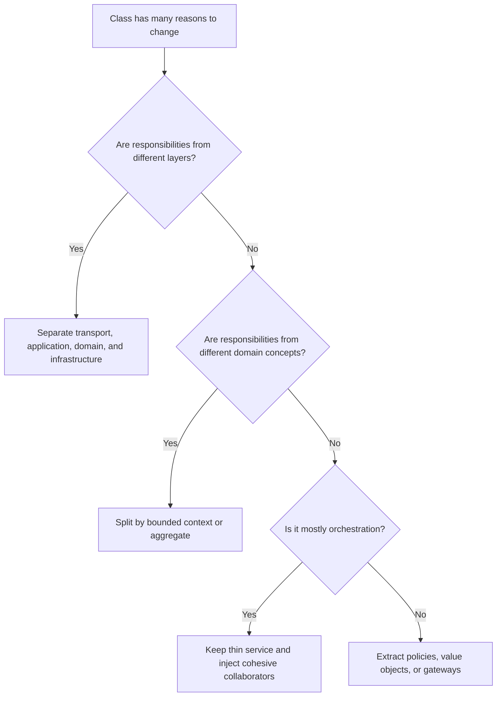

# God Class

A god class centralizes too many responsibilities, knows too much about the
system, and becomes the place where unrelated changes accumulate.

## Philosophy

Large legacy systems often grow around a few "manager", "helper", "service", or
"processor" classes. These classes feel productive because everything is nearby,
but they destroy ownership. A god class is a coordination failure expressed as
code.

The remedy is not arbitrary splitting. The remedy is discovering cohesive
responsibilities and assigning them to the right architectural layer.

## Explanation

Signals:

- many unrelated public methods;
- dependencies on database, HTTP clients, filesystem, settings, queues, and
  domain objects at once;
- frequent changes for unrelated features;
- private methods grouped by comment sections;
- tests that require extensive mocking;
- unclear name such as `Manager`, `Helper`, `Utils`, or `Processor`;
- knowledge of multiple bounded contexts.

## Bad Example

```python
class BackupManager:
    def validate_settings(self): ...
    def connect_to_database(self): ...
    def run_postgres_backup(self): ...
    def upload_to_s3(self): ...
    def send_email(self): ...
    def cleanup_files(self): ...
    def write_audit_log(self): ...
    def render_api_response(self): ...
```

This class owns configuration, database access, backup execution, storage,
notification, cleanup, audit, and API mapping.

## Good Example

```python
class BackupApplicationService:
    def __init__(
        self,
        planner: BackupPlanner,
        executor: BackupExecutor,
        storage: BackupStorage,
        audit: BackupAuditLog,
    ) -> None:
        self._planner = planner
        self._executor = executor
        self._storage = storage
        self._audit = audit

    async def run_backup(self, command: RunBackupCommand) -> BackupResult:
        plan = self._planner.create_plan(command)
        artifact = await self._executor.execute(plan)
        location = await self._storage.store(artifact)
        await self._audit.record(command.job_id, location)
        return BackupResult(location=location)
```

The application service orchestrates cohesive collaborators instead of owning
their details.

## Decision Tree



## Refactoring Strategies

- Identify reasons to change from recent commits or feature requests.
- Group methods by domain concept and architectural layer.
- Extract value objects for data plus validation.
- Extract gateways for external systems.
- Extract repositories for persistence.
- Keep orchestration thin and named by use case.
- Migrate callers incrementally to avoid a risky big rewrite.

## AI Guidance

- Do not split by method count alone. Split by responsibility and boundary.
- Avoid creating several smaller god classes named `Helper`.
- Preserve public behavior with tests before extraction.
- Update Project Brain when a god class reveals missing domain concepts or
  bounded contexts.

## Review Checklist

- The class has one primary reason to change.
- Dependencies belong to the class's architectural layer.
- Public methods are cohesive.
- Cross-context knowledge is removed or explicitly justified.
- Extracted collaborators have clear names and ownership.
- Tests prove behavior did not drift during extraction.

## References

- SOLID: `../engineering/solid.md`
- GRASP: `../engineering/grasp.md`
- Domain Services: `../domain/domain-services.md`
- Bounded Contexts: `../domain/bounded-contexts.md`
