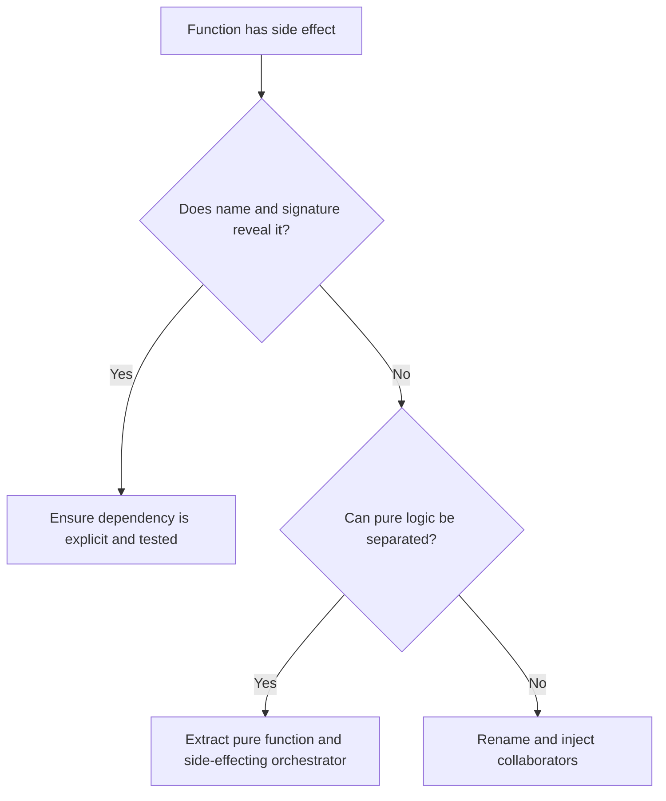

# Hidden Side Effects

Hidden side effects occur when code that appears to compute or validate also
changes external state, reads mutable global state, performs I/O, emits events,
updates caches, mutates inputs, or depends on time and randomness without making
that behavior explicit.

## Philosophy

Side effects are necessary. Databases, APIs, files, queues, logs, metrics, and
clocks are real system concerns. The smell is not the effect itself; the smell
is surprise. A caller should know when a function can change the world, fail due
to external state, or produce different results for the same input.

## Explanation

Common hidden side effects:

- validation functions that write audit records;
- property access that queries a database;
- constructors that open network connections;
- module imports that create clients or mutate configuration;
- functions that mutate input dictionaries;
- domain methods that read environment variables;
- cache updates hidden inside formatting functions;
- clock or random usage inside core logic without injection.

## Bad Example

```python
def calculate_invoice_total(invoice: dict) -> int:
    invoice["calculated_at"] = datetime.utcnow().isoformat()
    audit_log.write("invoice_calculated", invoice["id"])
    return sum(item["amount_cents"] for item in invoice["items"])
```

The name promises calculation, but the function mutates input, reads time, and
writes audit state.

## Good Example

```python
def calculate_invoice_total(items: list[InvoiceItem]) -> int:
    return sum(item.amount_cents for item in items)


class InvoiceApplicationService:
    def __init__(self, clock: Clock, audit_log: AuditLog) -> None:
        self._clock = clock
        self._audit_log = audit_log

    def calculate_and_record(self, invoice: Invoice) -> InvoiceTotal:
        total = calculate_invoice_total(invoice.items)
        calculated = InvoiceTotal(total, calculated_at=self._clock.utcnow())
        self._audit_log.record_invoice_calculated(invoice.id, calculated)
        return calculated
```

Pure calculation and side-effecting orchestration are separate.

## Decision Tree



## Refactoring Strategies

- Separate pure calculation from I/O orchestration.
- Inject clocks, random generators, repositories, clients, and publishers.
- Avoid work in constructors beyond assigning dependencies.
- Replace mutating input dictionaries with immutable value objects or returned
  copies.
- Move import-time side effects into startup or composition roots.
- Name commands and methods with verbs that reveal state changes.

## AI Guidance

- Treat time, randomness, environment variables, and global settings as side
  effects.
- Do not hide side effects to make tests shorter.
- Prefer pure domain functions where possible and application services for
  orchestration.
- Add tests that verify both returned values and intentional effects.

## Review Checklist

- Function names honestly describe state changes.
- Pure logic is separated from I/O where practical.
- Side-effecting dependencies are injected.
- Constructors and imports do not perform surprising work.
- Inputs are not mutated unless the API explicitly promises mutation.
- Tests cover failures from external dependencies.

## References

- Architecture Constitution: `../architecture/constitution.md`
- Service Locator: `../anti-patterns/service-locator.md`
- Dependency Injection: `../engineering/dependency-injection.md`
- Fail Fast: `../engineering/fail-fast.md`
