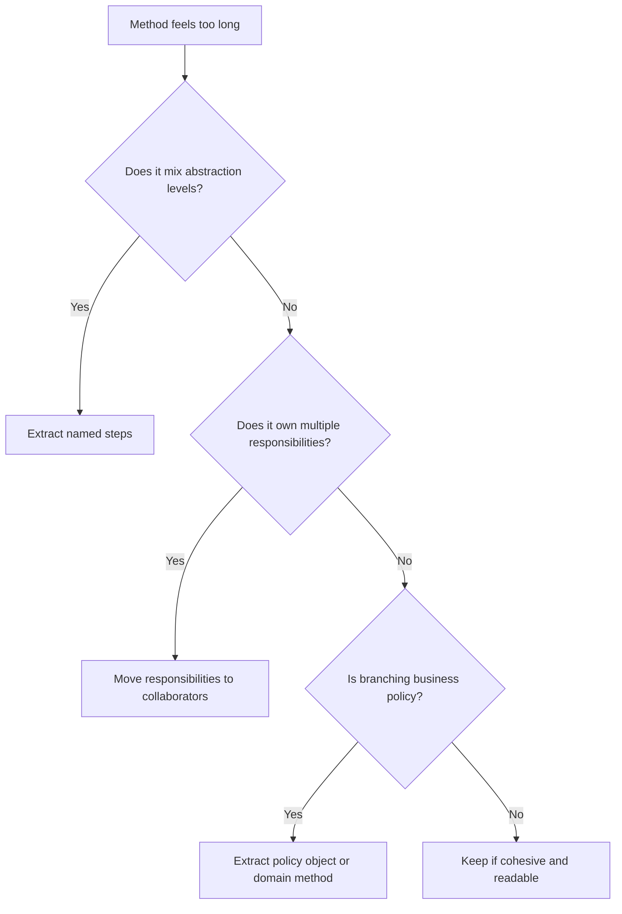

# Long Method

A long method is a function or method that tries to do too much at once. Length
is a signal, not the diagnosis. The real problem is mixed abstraction levels,
hidden workflow steps, duplicated policy, and untestable branching.

## Philosophy

Functions should tell one coherent story. A reader should understand the
workflow from the top level and inspect details only when needed. Long methods
often hide multiple responsibilities that should be named.

Short code is not automatically good. A compressed method with dense boolean
logic can be worse than a longer but clear workflow. The standard is clarity,
cohesion, and testability.

## Explanation

Long methods often contain:

- validation, authorization, persistence, external calls, and formatting in one
  block;
- deeply nested conditionals;
- repeated setup and cleanup;
- comments acting as section headers;
- local variables that exist only to carry state between unrelated steps;
- difficult partial testing.

## Bad Example

```python
async def restore_backup(request: RestoreRequest) -> RestoreResponse:
    if not request.backup_id:
        raise ValueError("backup id required")
    user = await get_current_user()
    if not user.can_restore:
        raise PermissionError("not allowed")
    row = await db.fetch_one("select * from backups where id = :id", request.backup_id)
    if row is None:
        raise NotFoundError("backup not found")
    path = await download(row["url"])
    result = await restore_database(path, request.target)
    await db.execute("insert into audit_log ...")
    return RestoreResponse(status=result.status)
```

The method mixes validation, authorization, persistence, I/O, domain workflow,
and response mapping.

## Good Example

```python
class RestoreBackupService:
    def __init__(self, backups: BackupRepository, restorer: DatabaseRestorer, audit: AuditLog) -> None:
        self._backups = backups
        self._restorer = restorer
        self._audit = audit

    async def restore(self, command: RestoreBackupCommand) -> RestoreResult:
        command.validate()
        backup = await self._backups.get_required(command.backup_id)
        result = await self._restorer.restore(backup, command.target)
        await self._audit.record_restore(command.requested_by, backup.id, result.status)
        return result
```

The top-level workflow is readable and collaborators own details.

## Decision Tree



## Refactoring Strategies

- Extract validation into command, value object, or policy.
- Extract persistence behind repositories.
- Extract external calls behind gateways.
- Replace nested conditionals with guard clauses when failure should stop the
  workflow.
- Extract domain decisions into domain methods.
- Split orchestration from formatting and transport concerns.

## AI Guidance

- Do not mechanically split code by line count. Name responsibilities first.
- Preserve transaction boundaries and error semantics when extracting methods.
- Avoid private-method sprawl that leaves the original class with too many
  responsibilities.
- Add characterization tests before refactoring risky legacy methods.

## Review Checklist

- The method has one clear responsibility.
- The top-level workflow reads in domain language.
- Validation, authorization, persistence, I/O, and response mapping are not
  tangled without reason.
- Branching logic is testable.
- Extracted collaborators improve cohesion.
- Behavior-preserving tests cover the refactor.

## References

- KISS: `../engineering/kiss.md`
- Single Responsibility Principle: `../engineering/solid.md`
- Refactoring: `../clean-code/refactoring.md`
- Testing: `../clean-code/testing.md`
