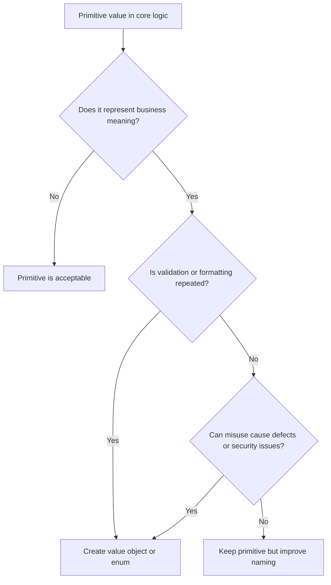

# Primitive Obsession

Primitive obsession occurs when domain concepts are represented only as generic
types such as `str`, `int`, `dict`, `list`, or `bool`, causing validation and
meaning to scatter across the codebase.

## Philosophy

Primitive values are useful at system edges. Inside the domain and application
core, important concepts deserve names. A value object can carry validation,
units, formatting rules, equality, and invariants in one place.

The goal is not object-heavy design. The goal is to make business meaning
explicit where mistakes are expensive.

## Explanation

Signals:

- repeated validation for IDs, emails, currencies, statuses, or date ranges;
- booleans that obscure intent, such as `process(True, False)`;
- dictionaries passed through many layers;
- amounts without currency or unit;
- strings that represent multiple concepts;
- functions with long primitive parameter lists.

## Bad Example

```python
def schedule_backup(job_id: str, frequency: str, retention: int, encrypted: bool) -> None:
    if frequency not in {"daily", "weekly"}:
        raise ValueError("invalid frequency")
    if retention < 1 or retention > 365:
        raise ValueError("invalid retention")
```

The concepts are unnamed primitives and validation will likely repeat.

## Good Example

```python
from dataclasses import dataclass
from enum import StrEnum


class BackupFrequency(StrEnum):
    DAILY = "daily"
    WEEKLY = "weekly"


@dataclass(frozen=True)
class RetentionDays:
    value: int

    def __post_init__(self) -> None:
        if self.value < 1 or self.value > 365:
            raise ValueError("retention must be between 1 and 365 days")


@dataclass(frozen=True)
class BackupSchedule:
    job_id: str
    frequency: BackupFrequency
    retention: RetentionDays
    encrypted: bool
```

The rule now has a name and a single owner.

## Decision Tree



## Refactoring Strategies

- Replace status strings with `StrEnum`.
- Replace amount integers with value objects that name units and currency.
- Replace primitive parameter groups with command or value objects.
- Replace ambiguous booleans with enums when more than two meaningful states
  exist or call sites are unclear.
- Use Pydantic models at API boundaries and domain value objects in core logic
  when domain invariants matter.

## AI Guidance

- Do not wrap every string. Wrap concepts with rules, risk, or repeated meaning.
- Keep serialization concerns at boundaries; do not let Pydantic schemas become
  the whole domain model by default.
- Preserve wire formats when adding enums or value objects.
- Add tests for invalid values and boundary cases.

## Review Checklist

- Important domain concepts have explicit names.
- Validation is centralized in the owning type or policy.
- Units and currencies are visible in names.
- Function signatures do not rely on ambiguous primitive parameter lists.
- API schemas and domain objects have clear responsibilities.
- Tests cover allowed and rejected values.

## References

- Value Objects: `../domain/value-objects.md`
- Magic Values: `../anti-patterns/magic-values.md`
- Pydantic v2: `../python/pydantic-v2.md`
- Explicit over Implicit: `../README.md`
