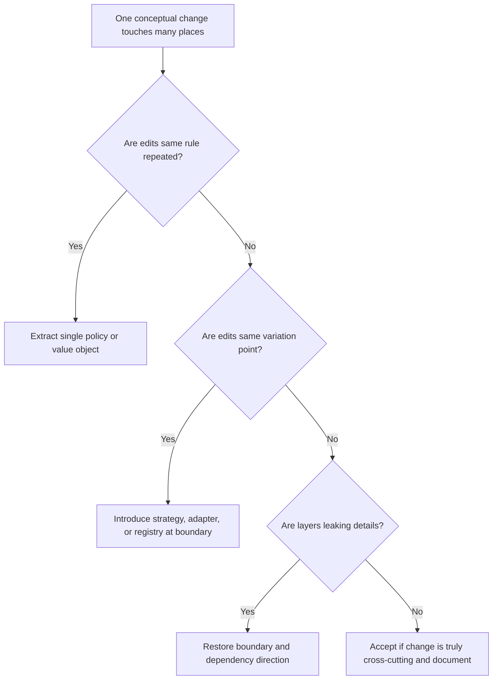

# Shotgun Surgery

Shotgun surgery occurs when one conceptual change requires many small edits
across unrelated files, modules, or layers.

## Philosophy

Healthy architecture localizes change. When a single policy, workflow, or data
concept forces scattered edits, the system has misplaced ownership or weak
boundaries. Shotgun surgery is expensive because it increases regression risk
and makes AI-assisted changes harder to review.

The remedy is not a giant abstraction. The remedy is finding the concept that
should own the change.

## Explanation

Signals:

- adding a status requires edits in routers, services, repositories, tests,
  serializers, and UI/API docs separately;
- changing validation requires touching many endpoints;
- adding a destination or database type requires editing conditionals across
  multiple modules;
- release notes repeatedly mention the same scattered files;
- small product changes produce large pull requests with low conceptual scope.

## Bad Example

```python
if destination_type == "s3":
    ...
elif destination_type == "azure":
    ...
elif destination_type == "folder":
    ...
```

If this conditional appears in upload, validation, configuration, logging, and
cleanup code, adding a destination causes shotgun surgery.

## Good Example

```python
class Destination(Protocol):
    def validate(self) -> None: ...
    async def upload(self, artifact: BackupArtifact) -> StoredArtifact: ...
    async def cleanup(self) -> None: ...


class DestinationRegistry:
    def create(self, destination_type: DestinationType) -> Destination:
        ...
```

The variation is owned by a single extension point.

## Decision Tree



## Refactoring Strategies

- Extract a policy object for repeated rules.
- Use strategy or adapter when a supported variation changes behavior.
- Move mapping logic to one boundary instead of duplicating it across layers.
- Replace scattered conditionals with polymorphism only when variation is stable
  and meaningful.
- Add characterization tests around the current scattered behavior before
  centralizing it.
- Use ADRs for cross-cutting decisions that must touch many places.

## AI Guidance

- Review the diff shape: many files with small similar edits often indicates
  shotgun surgery.
- Do not overcorrect by creating a generic plugin system without evidence.
- Prefer a narrow extension point for the actual variation.
- Record recurring scattered change patterns in Project Brain so future phases
  can target the right boundary.

## Review Checklist

- One conceptual change has one primary owner where practical.
- Repeated conditionals were evaluated as variation points.
- New abstractions are named after domain or operational concepts.
- Boundary leakage was addressed instead of hidden.
- Tests cover the centralized policy or variation point.
- Any truly cross-cutting change has documented rationale.

## References

- Open/Closed Principle: `../engineering/solid.md`
- Strategy Pattern: `../patterns/strategy.md`
- Adapter Pattern: `../patterns/adapter.md`
- Tight Coupling: `../anti-patterns/tight-coupling.md`
